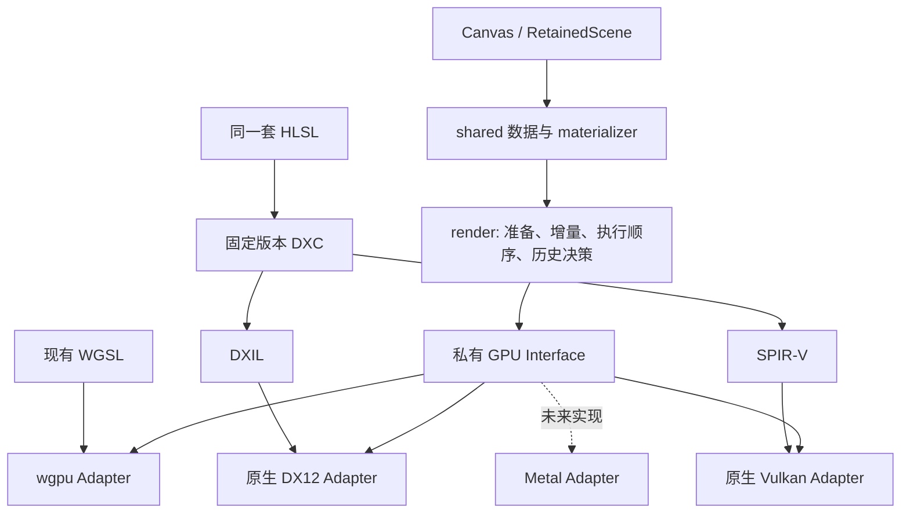

# Tileink 原生 HLSL 后端实施计划

状态：**M0 实施中，原生后端尚未实现**。已开始建立 wgpu 的严格跨 API 参考运行器并修正基线缺陷；进度、实测差异与剩余门槛见 [实施记录](NATIVE_BACKEND_PROGRESS.md)。下面的 native feature、接口和目录仍为待实现设计。

日期：2026-09-07。代码调研基线：`eabbe0b97b392582d663206c1f2aad51f76695aa`。

## 1. 目标与不可放宽的验收条件

在 Tileink 中增加可选的原生 GPU 后端，与现有 wgpu 后端共存。原生后端以同一套受版本管理的 HLSL 为源码，通过 DXC 分别生成 DXIL 和 SPIR-V，直接调用 DX12 与 Vulkan。默认构建和默认渲染选择仍为 wgpu。

用户已确认：**wgpu-DX12、wgpu-Vulkan、原生 DX12、原生 Vulkan 四种输出必须互相逐像素、逐通道完全一致。** 同一测试帧的四份有效像素字节必须相等，差异像素数和最大通道差值都必须为 0。不能用容差、SSIM、忽略透明像素、按后端保存不同 golden，或更新基准图来代替这个条件。

首期四路验收在 Windows 上进行：每次比较使用同一物理 GPU、相同输入、输出格式、分辨率和颜色语义。再在声明支持的 GPU/驱动矩阵上逐项重复验证。该要求不自动扩大为不同 GPU、不同操作系统、任意驱动版本之间的全局字节一致；支持范围必须由实际测试记录界定。

跨 API 的精确一致性目前**未经验证**。先验证现有两条 wgpu 路径，再验证两条原生路径的最小渲染切片。如果有差异，先修正算法、精度约定或资源语义；不能把“看起来一样”当作通过，也不能预先保证换成 HLSL 就会一致。

### 首期范围

- 完整保留 Canvas、RetainedScene、路径、SDF、文字、图片、渐变、裁剪、混合、图层、mask、filter、backdrop、SVG 以及增量绘制语义。
- Windows：原生 DX12 和 Vulkan；允许一个构建同时包含 wgpu 和两条原生路径，并显式选择实例使用的后端。
- 保留 Linux、macOS 上现有 wgpu 构建与行为。原生 Vulkan 在 Linux 上的构建和适用测试也纳入验证；Windows 的四路门槛不能被 Linux 的两路结果替代。
- 原生渲染支持自有离屏目标和调用方提供的兼容纹理，为之后 gfx_ui 接入提供设备、目标及同步接口。
- 为未来 Metal/macOS 留出清晰 Adapter 边界；本轮不实现 Metal，也不以 MoltenVK 的可运行性宣称完成原生 Metal 支持。

本计划只安排 Tileink 内的工作。gfx_ui、trading app 的迁移另外安排。Tileink 渲染器不接管应用的窗口事件或生产用 swapchain 策略；后续 gfx_ui 仍需单独处理 acquire、resize、present 的等待。因此原生 Tileink 的收益不能直接当作应用 Surface 配置等待的收益。

## 2. 当前结构与迁移依据

| 当前实现 | 对计划的约束 |
| --- | --- |
| `Cargo.toml` 强依赖 wgpu；`src/lib.rs` 无条件导出 wgpu 渲染入口 | 首先让 wgpu 成为默认启用的可选依赖；原生独立构建不能暗中带入 wgpu/wgpu-hal 运行时 |
| `src/shared/` 已有 GPU 数据、ExecPlan、图片和文字等共用表示 | 在现有模型上抽取渲染逻辑，避免再建立一套场景格式 |
| `src/retained_scene/materializer/` 部分类型依赖 `src/wgpu/incremental.rs` | 把真正与后端无关的 damage、history 决策、统计类型移到共享层，解除反向依赖 |
| `src/wgpu/renderer/` 集中处理准备、执行、图层、输出和历史；pipeline 延迟初始化 | 逐步分离 GPU 调用与渲染调度；保持延迟编译和资源复用，避免构造时无条件编译所有 pipeline |
| `src/wgpu/commands.rs` 有 uniform 写入聚合和有条件的提前提交 | 共享批次顺序与提交策略，API 侧负责资源状态和实际提交；禁止每次 dispatch 都提交或等待 |
| 现有 wgpu `native/portable` 是纹理执行路径 | 它们不是本计划的原生 API 后端；测试参数、日志、文档必须分开命名 |
| `build.rs` 展开 WGSL；`build/dxil.rs` 为 portable fine 生成可选预编译 DXIL | 现有 DXIL 路径不是完整原生后端；不能只移植 fine 或把 WGSL 转译后称作维护中的 HLSL 实现 |
| `src/wgpu/renderer/output.rs` 已有 `ExternalTextureHistoryId` 及 transient/persistent 输出语义 | 原生外部目标必须保留相同的内容有效性、失效和设备归属规则 |
| `scripts/ps1/run_tests.ps1` 用串行子进程分组运行 GPU 测试 | 延续单线程、进程隔离和实际启用 GPU 测试的约定，不能只运行默认跳过 GPU 的测试命令 |
| `compare_png_pixels` 已支持严格解码像素比较 | 复用比较语义；新增四路同一帧比较和运行清单，不再造一个宽松的比较器 |
| crate 的 `include` 使用明确的文件白名单 | 新 HLSL、include 和 ABI 描述必须加入打包规则，验证包内可以构建原生 feature |

开发要求以 [AGENTS.md](AGENTS.md)、[CONTRIBUTING.md](CONTRIBUTING.md)、[GPU 管线文档](website/docs/architecture/gpu-pipeline.md)、[RetainedScene 架构](website/docs/architecture/retained-scene.md) 和 [BENCHMARKS.md](BENCHMARKS.md) 为准。下面的四路零差异条件比外部 resvg 参考图的比较规则更严格，两者分别执行。

## 3. Feature 与运行时选择

采用 Cargo 的加法式 feature，不用互斥 feature 选择唯一后端。拟定名称和依赖关系如下；表格不是已存在的 Cargo 配置。

| Feature | 作用 | 平台 |
| --- | --- | --- |
| `wgpu` | 启用可选 wgpu 依赖、WGSL 构建和现有 WgpuRenderer | 保留目前支持范围；列入 `default` |
| `native-dx12` | 启用原生 DX12 Adapter、HLSL→DXIL 构建 | DX12 实现仅编译于 Windows |
| `native-vulkan` | 启用原生 Vulkan Adapter、HLSL→SPIR-V 构建 | 首期 Windows/Linux |
| `native` | 聚合启用 `native-dx12` 和 `native-vulkan` | Windows 上一次启用两个原生后端；各 Adapter 仍按目标平台编译 |

必须验证这些组合：默认 wgpu、默认加 `native`、无默认加 `native-dx12`、无默认加 `native-vulkan`、无默认加 `native`、无默认且无渲染后端。最后一种只暴露可用的场景/CPU 功能，不伪造可运行的渲染器。

平台不支持的 Adapter 不编译原生 API 代码；显式请求不可用的运行时后端返回明确的 `BackendUnavailable`/能力错误。`native-dx12` 在非 Windows 上不会变成另一种后端。`--all-features` 的平台兼容性也要测试，不能靠在所有平台无条件链接 DX12 来实现聚合 feature。

默认 `Renderer`/`WgpuRenderer` 入口在启用 `wgpu` 时保持其既有含义。新增显式 `NativeRenderer` 和 `NativeBackend::{Dx12, Vulkan}` 入口；不根据是否安装了某个驱动悄悄改变默认后端。强制选择的后端不可用时失败，测试中绝不自动回退。

`directwrite-reference`、`vello-compare`、现有示例和 benchmark 的依赖需要逐项处理：需要 wgpu 的入口声明相应 `required-features`，共享测试则真正变为后端无关。将纯 CPU 测试误加上 wgpu feature、或者把原生单后端测试全部跳过，都不算完成拆分。

普通 wgpu 构建保留现有可选 DXIL 编译/回退行为，不新增强制 DXC 前提。显式启用原生 feature 后，对应编译器或经过验证的产物缺失必须报错；不能回退为 WGSL 或 wgpu 执行。用 `cargo tree` 分别审计原生单后端的普通依赖和构建依赖，确认没有无意引入 wgpu/wgpu-hal。

## 4. 模块边界与接口

设计采用一个共享渲染调度 Module 和三个 GPU Adapter。Interface 以 Tileink 需要的计算任务为限，不复制一套通用图形 API。



### 拟定职责分布

| Module / 目录 | 职责与隐藏的细节 |
| --- | --- |
| `src/shared/`、`src/retained_scene/` | 场景表示、事务、CPU 编译、数据布局；不能依赖任何 GPU Adapter |
| `src/render/` | 共享准备和执行算法、damage、历史有效性、offscreen 计划、能力驱动的输出策略、阶段统计；每个 Renderer 实例持有自己的状态 |
| `src/render/backend.rs` | 私有 Seam：有类型的资源与 program 标识、批次编码、upload/copy/dispatch、必要的同步和完成查询；不暴露 DX12/Vulkan/wgpu 类型 |
| `src/wgpu/` | 保留公开 wgpu 接口；接入共享调度，适配 wgpu 资源、绑定、WGSL/既有 DXIL、提交与 readback |
| `src/native/` | 原生公开构造入口、能力与错误、目标/提交生命周期；把选择分派到具体 Adapter |
| `src/native/dx12/` | windows bindings、device/queue、资源分配、descriptor、root signature、PSO、resource state、fence、readback |
| `src/native/vulkan/` | ash、instance/device/queue、资源分配、descriptor、pipeline layout、pipeline、image layout、barrier、同步、readback |
| `src/shaders/hlsl/` | 共享 HLSL 算法与 include；差异仅限必要的绑定或能力适配，不复制 DX12/Vulkan 算法主体 |
| `build/shaders/` | shader 清单、DXC 调用、ABI 检查、缓存键、产物元数据；与运行时 device 生命周期无关 |
| `tests/support/` | 共用场景序列、执行清单、设备匹配、readback 与零差异断言；后端差异藏在测试 Adapter 内 |

文件按实际职责再拆分，不一次建立大量空文件。Metal 只通过这些现有边界扩展，不提交永远返回 unsupported 的空实现，也不预先设计多队列图形引擎。

共享执行器使用泛型或等价的静态分派。运行时后端选择集中在构造和帧入口；避免在每个 draw/tile 中重复 `match backend`。WgpuRenderer 的外部纹理包装、NativeRenderer 的原生资源所有权属于各自公开接口的实际职责，不额外叠加没有语义的转发层。

### 必须保留的共享语义

1. `TILE_SIZE = 16`、painter order、clip/group 栈、draw 和图层顺序保持一致；顺序来自执行计划，不来自 arena 地址或 GPU 执行碰巧的顺序。
2. immediate 与 retained 使用同一渲染算法。每个 Renderer 独立维护 journal cursor、materializer、GPU 资源和输出历史；可以消费同一场景，但不能共享可变设备资源或历史游标。
3. RetainedScene 事务原子性、稳定句柄、journal 丢失后的完整同步及恢复增量行为保持不变。
4. `ForceFull` 改变损伤覆盖范围，不改变颜色、绘制或图层语义。尺寸变化引起完整重绘时，避免无理由重新编译原本可复用的 CPU 几何。
5. 保留 direct fine dispatch、dense/sparse active tiles、二维 dispatch 上限处理、尾部越界保护，以及 scan/coarse/filter 的阶段间顺序。只有算法真正需要的地方才使用 atomic。
6. portable 的 ping-pong/copy 与支持直接纹理访问时的执行方式可不同，但像素语义相同。能力不足时采用已验证的算法路径，或者明确拒绝；不能省略效果。
7. offscreen/filter/backdrop 所用资源与 uniform staging 在 GPU 完成前不可回收或覆盖。容量复用、懒编译、有限的提前提交保留在可测试的职责中。

### 原生上下文、目标与同步

第一版接口必须同时覆盖渲染器创建自己的上下文和借用应用创建的上下文，后者为未来 gfx_ui 使用同一 device/queue 提供入口。公开接口的定稿交付物包括构造、能力查询、`render`/`render_retained`、外部目标渲染、异步提交完成令牌及显式 readback，不在本计划中冻结所有 Rust 签名。

- DX12 使用原生 D3D12/DXGI 接口，Vulkan 使用 ash；原生运行路径不经过 wgpu-hal。
- 外部目标按 Adapter 有类型地注册，记录 device identity、格式、尺寸、usage、初始/最终资源状态及必要的队列所有权。跨设备、无效 usage、错误尺寸或不支持格式在提交前报告错误。
- 裸句柄导入的 `unsafe` 边界集中在 interop Module，并写明调用方对设备、队列、资源与同步的责任。安全包装和资源租约保持到完成令牌结束；仅有 Rust 借用结束不代表 GPU 已完成。
- transient 目标没有可依赖的上一帧内容；persistent 目标沿用 `ExternalTextureHistoryId` 的内容身份语义。重建、resize、外部 clear/写入、device loss 必须失效。交换链每个 image 的历史分别管理，不能把“上一次屏幕帧”当成当前 acquired image 的历史。
- 初期单渲染队列足够；按批次提交，fence/完成序号驱动回收。处理 GPU 读写可见性、纹理布局/状态转换和跨调用方的等待/信号，不能只保证命令排列顺序。
- 正常 render/resize 不无条件调用 `device.wait_idle` 或全队列等待；readback、资源真正不可安全复用和销毁时的等待必须可观察、可解释。设备丢失后不能继续复用旧目标历史。
- swapchain 的创建与 present 位于原生示例或未来宿主。Tileink 接收已取得的目标，不把窗口、present mode、DXGI resize 或 Vulkan surface 扩展写进共享渲染接口。

## 5. HLSL、ABI 与构建产物

原生 HLSL 是受版本管理的第一等源码；WGSL 保留为 wgpu 的独立实现及回归参照。两种语言按同一算法规格维护，修复共享语义时配套更新测试。不能将四条路径全部改为调用同一个 wgpu 实现来获得相等输出。

### 移植清单

用构建清单和运行时 pipeline 创建点核对全部入口，至少覆盖：

- range scatter / 场景部分上传；不能只盘点 `build.rs` 的顶层 WGSL 展开列表。
- scan 的 clear、count、prefix、chunk offsets、apply offsets、emit，以及 cumsum。
- coarse 的 count、prefix、emit 与相应纹理执行变体。
- fine 的 path、SDF、glyph、image、gradient、clip、blend 和写回。
- 全部 filter、mask、layer、backdrop、采样与必要的 transfer/copy/clear 操作。

每个入口记录 workgroup 维度、绑定、常量、buffer stride、纹理格式、访问方式、变体、所需能力和对应测试。已移植状态以这份清单为准，不能仅以“SVG tiger 能渲染”判定完整。

### ABI 和编译约定

1. 建立单一、明确的 shader ABI 描述，复用现有 `src/shared/gpu_layout.rs`、`gpu_types.rs` 等布局事实；从中生成或验证 Rust/HLSL 的 offset、size、alignment、array stride 和绑定映射。以哨兵值往返测试覆盖结构体数组、嵌套结构、向量、动态 offset 和纹理表边界。
2. 同一 HLSL 经 DXC 输出 DXIL / SPIR-V。固定并记录 DXC 版本及文件摘要、target profile、SPIR-V target environment、所有编译参数；选择最低可满足现有算法的能力集，而非默认要求最新 Shader Model 或 Vulkan 扩展。
3. 固定 register/space 与 set/binding 映射，用编译产物的反射/验证检查 root signature 和 descriptor layout。不要假设 DXIL 和 SPIR-V 默认采用相同结构体布局。
4. 不盲目打开 `-fvk-use-dx-layout`：DXC 文档指出该布局依赖 scalar block layout 支持。优先明确并验证公共布局；若使用相关能力，创建 device 时查询/启用，并列入支持矩阵。[DXC SPIR-V 文档](https://github.com/microsoft/DirectXShaderCompiler/blob/main/docs/SPIR-V.rst)
5. shader 缓存键涵盖全部源/include、ABI、variant、编译器及其依赖、flags、目标。原生 pipeline 缓存另含 GPU/driver/API 标识并校验兼容性；错误或陈旧缓存不得被接受。shader 产物缓存与驱动 pipeline 缓存分开管理。
6. 默认构建不下载工具。原生开发和 CI 使用明确安装的 DXC；若使用预编译产物，必须验证其完整缓存键，不能只按文件名加载。native-only 构建跳过不需要的 WGSL 工作，wgpu-only 构建跳过原生 shader 工作。
7. 更新 Cargo 打包白名单并对打包后的源码做构建验证，检查 include 文件没有漏包。编译失败包含 shader/entry/target/flags 和诊断；不能产生看似成功的空 shader 或 fallback 标记。

## 6. 四路完全一致的测试设计

### 输入与比较合同

一个 case 提供固定资源和完整帧序列，四条路径分别创建独立 Renderer 后消费相同序列。CPU 字体解析、图片解码、随机种子、时间、DPI 和变换固定；共用不可变输入，不共用被某一路修改的渲染状态。

首期输出以现有 `Rgba8Unorm` 为规范格式。每一帧都在 GPU 完成后取得应用目标的有效像素，剔除 readback row pitch 的无效填充，按声明的物理通道顺序解释；不做额外颜色校正、四舍五入或 alpha 清理。比较的是交付给宿主的 RGBA 像素，不是 DWM 截图或 PNG 压缩文件字节。

对每帧执行：

```text
wgpu_dx12.rgba == wgpu_vulkan.rgba
wgpu_dx12.rgba == native_dx12.rgba
wgpu_dx12.rgba == native_vulkan.rgba
```

这三个零差异比较通过传递性约束全部六个配对，不需要重复渲染六次。hash 仅用于索引/报告，最终依据完整长度和有效字节比较。必须比较 alpha，也比较 alpha 为 0 时的 RGB。未来新增格式时，先定义该格式的精确表示和比较合同，不能通过转成 8 位掩盖差异。

PNG 工件使用现有严格解码比较语义，保留失败的四张输出、差异图、首个差异坐标/通道、差异像素数、最大通道差值和运行清单。压缩和非像素元数据变化不属于像素差异；缺失、损坏、重复或尺寸错误的输出直接失败。

### 独立于四路相等的正确性保障

四路可能一起变错，所以同时保留固定基线提交的 PNG、现有语义断言、适用的 resvg/文字参考和 intermediate 检查。先捕获并保留旧结果，比较命令不重生成或覆盖基准图。

若为了确定性需要修正现有 wgpu 行为，先加入定位根因的回归测试，再修改公共语义和两套 shader，单独解释与旧 PNG 的变化并交由开发者审阅。该审阅用于确认渲染变化正确，**不能批准四路非零误差作为通过**。不得按 fixture、GPU 厂商或后端选择另一套“期望像素”。

### 数值差异定位

`precise` 或编译器浮点约束只是控制优化的工具，不保证跨 API、驱动或 shader 编译结果逐位相同。HLSL precise 对重排和融合的限制可帮助定位，但不能替代测量。[Microsoft precise 文档](https://learn.microsoft.com/en-us/windows/win32/direct3dhlsl/precise)

在两路 wgpu 的基线阶段和四路最小切片阶段，重点检查：

| 风险 | 验证与修正原则 |
| --- | --- |
| FMA、运算重排、除法、sqrt/其他超越函数、非正规数、NaN | 明确有效输入、运算顺序和边界处理；定位到具体操作，再采用各路径一致的算法，不承诺某个全局编译开关即可解决 |
| UNORM 舍入、颜色编码、premultiplied alpha | 固定在管线哪一步转换与量化；半整数、近 0/1、透明像素单独覆盖；不得在测试 readback 后修补像素 |
| 纹理插值、边界采样、坐标原点 | 固定过滤和寻址语义；若硬件插值精度造成差异，评估在生产 shader 中使用一致的显式采样/运算，并测试性能和原有语义 |
| wave/subgroup 大小、reduction、atomic 顺序 | 保持确定的顺序与整数累加语义；禁止依赖调度顺序或隐含 wave 宽度 |
| 未初始化区域、barrier、旧 history、越界读 | 增加带哨兵值的语义测试、尾组和资源复用测试；修复同步/初始化根因，不能用额外全局等待长期掩盖错误 |

调试复用 `render_with_options` 的捕获思路，把扫描、prefix、coarse、fine、filter 中间结果按相同 program/stage 命名输出。整数偏移/计数应精确相等；浮点中间值用于找到最终像素差异的第一处来源。最终 RGBA 的零差异门槛始终不变。

### 运行矩阵与防止假通过

- 必跑 Windows 四路。wgpu 的 DX12/Vulkan 后端通过 API 显式指定，原生两路也明确指定；记录实际选中的 API、GPU、驱动、能力、shader 摘要和 pipeline 变体。
- 用 DX12 adapter LUID 与 Vulkan 设备标识匹配同一物理 GPU；无法可靠匹配时该测试无法认证，不能根据显示名称相似就视为同一设备。
- 在上述四路矩阵之外，继续覆盖适用的 wgpu texture `native/portable` 路径及现有 DXIL 预编译开/关变体；这些变体也必须满足同一像素合同。不能复用 `TILEINK_WGPU_MODE` 表示原生 API。
- 首次完整渲染、连续静态帧、实际增量帧、ForceFull、目标替换和独立重复运行均比较每一帧。至少三次独立运行用于检查不稳定输出；固定 case manifest 与实际输出计数，缺一个 case/frame/route 就失败。
- 普通无 GPU runner 可以执行构建/CPU/比较器测试，并明确报告未认证项。发布所需的硬件 job 缺 GPU、缺后端、跳过全部 GPU 测试或退回软件适配器，均不能算通过。
- M0 记录可用设备；原生功能完成前，required Windows 矩阵覆盖 NVIDIA、AMD、Intel 的代表设备和记录的驱动版本。某项环境缺失时保留未完成状态，不能静默缩小矩阵后宣布完整支持。
- Linux 对同机 wgpu-Vulkan/原生 Vulkan 执行适用的相等与语义测试；macOS 延续现有 wgpu-Metal 回归。原生 Metal 将来加入时，需要新的明确像素验收矩阵。

### 语义与边界场景

| 类别 | 必须包含的测试 |
| --- | --- |
| 基础与 dispatch | 空场景、透明/不透明 clear、1×1、15/16/17 tile 边界、非整行 pitch、宽高不同、dispatch 跨二维限制、空 active list、tail workgroup；零尺寸/超限输入按统一约定返回或拒绝 |
| 几何与绘制 | path、fill rule、stroke/dash、所有 SDF、重叠顺序、深 clip/group、分数坐标、DPI、负向/非整数变换、相邻 tile 接缝 |
| 资源与颜色 | 字形/emoji、图片替换、纹理表容量增长、gradient、各种 alpha、采样边缘、blend、颜色转换和舍入边界 |
| 合成 | 普通/嵌套 layer、mask、全部 filter、backdrop、裁剪/偏移 offscreen、dirty filter halo、复用与回收后的目标 |
| Retained | 插入/删除/重排/reparent、几何/图片变化、局部损伤、静态复用、journal 溢出恢复、多 Renderer 消费同一场景、Auto 对 ForceFull、resize 后再局部更新 |
| 外部目标与同步 | transient/persistent、同纹理新历史 ID、换纹理但尺寸相同、外部 clear、多个交换链 image、错误 device/usage、跨调用方同步、提交后释放/增长/复用资源、设备丢失的错误路径 |
| 完整输入集 | 现有全部 SVG 类别、全部示例及文字/图片资源；复用场景生成函数，所有支持效果都覆盖四条路径，不能只运行新增小样例 |

比较器还需要语义测试：相等、单通道差 1、透明 RGB 不同、alpha 不同、尺寸/文件缺失、row pitch、重复/missing 帧，以及 16 位 PNG 原有严格比较行为不退化。

## 7. 性能验证与观测

原生 API 只提供优化空间，不保证自动更快。先通过像素和语义门槛，再报告收益；绝不以快但错误的图像参与性能结论。

扩展现有 Criterion 场景使其选择后端，共用场景和采样条件。至少包含 `retained_scale`、`retained_dirty_ratio`、`retained_stress`、`root_batches`、range scatter/上传，以及新增的持续 resize/目标重建场景。CPU 算法基准保持独立，避免给本来不使用 GPU 的测试套上设备初始化。

- 同机分别比较原生 DX12 对 wgpu-DX12、原生 Vulkan 对 wgpu-Vulkan；固定 GPU、尺寸、场景、增量模式、编译模式和 GPU 完成条件。
- 保留原始默认 wgpu 基线，防止共享调度重构拖慢既有后端。benchmark 采样按照仓库约定等待提交的 GPU 工作完成，不能把“只测提交、GPU 还没做完”当作速度提升。
- 分开测 cold start/shader/pipeline 创建与已预热的 steady state；稳定的 mutation cycle 先完成 warmup。延迟 pipeline 编译和缓存命中另记数据。
- 记录 CPU prepare/record/submit、upload 字节、dispatch/copy/提交次数、分配/复用、fence 等待、GPU 阶段时间及完整帧耗时。诊断 readback 不混进生产渲染耗时。
- resize 用固定尺寸序列和固定样本数量记录 P50/P95/PMax、PMax 所在帧及各阶段的时间占比；交替运行后端并重复，以判断尖峰来自渲染、资源分配或同步。不能仅比较一次最大值或把等待转移到下一阶段称作消除。
- Criterion 必须显示无显著退化或改善；相同规模的端到端结果同时给出。每项性能优化都有对应 benchmark 和像素回归，不给不具备证据的百分比承诺。

Tileink 层 resize benchmark 覆盖渲染目标变化。窗口 swapchain 的 acquire/configure/present 应由独立原生示例或未来 gfx_ui 集成测试观测，报告中清楚区分二者。

## 8. 实施里程碑与依赖

依次推进 `M0 → M1 → M2 → M3 → M4 → M5 → M6`。每阶段都是独立可审阅的变更；只通过较早阶段不能宣称原生 feature 已完成。

### M0 — 固定基线并验证现有两路 wgpu

- [ ] 固定实现开始时的提交、完整 case/frame manifest、字体/图片/SVG 资源摘要、编译器和 GPU/驱动记录，保存不可被后续运行覆盖的基线。
- [ ] 建立明确选择 DX12/Vulkan 及物理 GPU 的参考运行器；复用现有测试分组、PNG 比较和示例场景。
- [ ] 跑现有 wgpu 两路全量 SVG/示例、关键 retained 帧序列与纹理执行变体，统计所有差异。
- [ ] 对差异先加入聚焦测试，定位 shader、采样、舍入或同步根因；记录公共数值语义和能力要求，修正并重跑。
- [ ] 保存默认 wgpu Criterion 基线和 resize 阶段数据，盘点完整 pipeline/ABI 与设备能力。

**退出条件：** 两路 wgpu 的规定输入零差异且已有正确性保障；产出可重跑命令、manifest、设备矩阵和差异调查结论。如果现有两路不能满足要求，继续定位并明确记录阻塞原因；不开始大规模原生管线移植，也不把验收降为同 API 比较。

### M1 — Feature 拆分与共享渲染边界

- [ ] 实现第 3 节 feature 图与平台 cfg，清理 CPU/shared 对 wgpu 类型的依赖。
- [ ] 抽取准备、增量和执行调度，以 wgpu 为第一个实际 Adapter；保持既有目标、历史、延迟编译和输出语义。
- [ ] 定稿原生上下文、外部目标、完成令牌和错误合同，为后续两条 Adapter 提供明确 Seam。
- [ ] 为共享状态迁移加入语义与边界测试；运行 feature 组合构建、默认 wgpu 全量回归及 Criterion 对照。

**退出条件：** 原生单后端可有独立依赖图；本阶段尚未完成的 native 构造返回明确不可用状态，不能伪装成功。既有 wgpu 输出与性能不退化，CPU 功能可独立构建。中间状态仅用于开发，不作为原生 feature 的发布完成状态。

### M2 — HLSL 构建、ABI 与产物验证

- [ ] 实现固定 DXC 的 DXIL/SPIR-V 编译和能力记录，包含版本发现、有效缓存、include 追踪与失败诊断。
- [ ] 建立全部 program/variant 清单、公共 ABI 和反射检查；先覆盖 clear/copy/简单像素与数据布局探针。
- [ ] 加入错误缓存、缺失编译器、绑定/stride 不匹配、native-only/wgpu-only 构建测试。
- [ ] 验证 Cargo 打包产物包含所有必需源文件，普通 wgpu 构建不额外要求 DXC。

**退出条件：** 相同 HLSL 可生成两种可验证产物，布局和缓存错误被可靠拒绝，不依赖运行时 WGSL 转译。

### M3 — 两个原生 Adapter 的最小纵向切片

- [ ] 先接通 DX12 的 device、资源、pipeline、dispatch、提交、完成、readback；尽早用相同 Interface 接通 Vulkan，验证边界确实容纳两种 API。
- [ ] 执行 clear/copy、布局哨兵、简单着色以及采样/量化/运算顺序风险探针；加入资源状态、GPU 生命周期与错误 device 测试。
- [ ] 四路同 GPU、同一帧序列零差异运行，重复检查确定性；使用 DX12 debug layer 和 Vulkan validation 检查原生路径。
- [ ] 基础 submit/readback 外不引入无条件全局等待，并保留阶段诊断。

**退出条件：** 最小切片的四路像素全部相等，API 验证没有未解释错误。跨编译目标的数值问题在这里定位；未通过前不进入完整 shader 移植。

### M4 — 完整计算管线和绘制效果

- [ ] 按 range scatter → scan/cumsum → coarse → fine → layer/mask/filter/backdrop 逐项移植，两条原生 Adapter 每项一起验收。
- [ ] 每一项先补语义/边界测试，再实现 HLSL 与绑定；检查中间结果和最终四路像素。
- [ ] 对文字、图片、gradient、所有 SDF/混合/采样执行变体完成清单，保留 painter order、dispatch tail 和资源边界。
- [ ] 共享资源池、uniform 聚合和提交策略；仅将 API 特有分配/同步保留在 Adapter 中。

**退出条件：** program 清单无遗漏，全部 immediate SVG/示例在四路中通过，阶段 benchmark 没有未解决退化。

### M5 — Retained、外部目标和持续帧

- [ ] 完成增量上传、损伤图、局部 filter/offscreen 复用、journal 恢复和多 Renderer 独立状态。
- [ ] 完成自有目标、transient/persistent 外部目标、surface origin、resize、device loss 的语义和同步测试。
- [ ] 增加原生示例展示两种 API 的上下文创建、目标获取、Tileink 渲染和提交/present 边界；不修改 gfx_ui 或 trading app。
- [ ] 跑完整状态序列，逐帧对照四路及 Auto/ForceFull，检查旧像素保留、history 失效和提交后资源回收。

**退出条件：** 完整功能在持续运行和目标变化后仍保持四路零差异；原生路径可以被未来宿主提供的 device/queue/目标使用。

### M6 — 全量验收、性能与文档

- [ ] 串行 release 语义/边界/回归测试、全部 SVG、全部示例和完整 feature/平台构建矩阵通过。
- [ ] required GPU 矩阵实际完成四路运行；生成完整 manifest、像素报告、失败工件和设备覆盖记录，缺项仍记未完成。
- [ ] 重跑 Criterion 与 resize 对照，报告平均、P95/PMax、阶段占比和内存；修复显著退化，不以降低视觉质量换速度。
- [ ] 完成格式、clippy、打包验证和代码审查；每个发现的问题补测试、修复、再验证。
- [ ] 更新 README、website 架构/GPU 管线文档、测试脚本说明、BENCHMARKS、CHANGELOG、原生 API 安全合同和支持矩阵。

**退出条件：** 用户要求的功能、四路完全一致、现有 wgpu 不退化和仓库 completion policy 同时满足，才将计划状态改为已实现。

## 9. 测试命令与交付证据

实现过程中先跑聚焦 release 测试，再扩大到相关完整测试；所有测试单线程。最后至少运行现有入口：

```powershell
.\scripts\ps1\run_tests.ps1 -WgpuMode both
.\scripts\ps1\run_svg_tests.ps1 -WgpuMode both
.\scripts\ps1\run_examples.ps1 -WgpuMode both
cargo test --release -- --test-threads=1
cargo fmt --all --check
cargo clippy --release --all-targets -- -D warnings
```

上述命令不代表已经覆盖新后端。M0/M3 扩展测试运行器，另提供带显式 API、Adapter、feature 和 case manifest 的四路入口；每个执行实例保持单线程并按已有 GPU 分组运行。将实际可执行命令和所需工具写入脚本 README，不把本计划中的拟定参数当作现有命令。

feature 检查除了默认组合，还须执行无默认、两个原生单选、原生聚合和共存组合的 `cargo check --release`、相关 release 测试及 clippy；检查 examples/benches 的 required-features。`cargo package`/包内构建使用对应 native feature 和准备好的 DXC 验证。平台矩阵包含 Windows、Linux、macOS 的适用组合，能力错误测试不能替代实际渲染。

最后交付以下证据，而非仅报告“测试通过”：

1. 固定提交/资源/运行环境的清单，四路实际后端与 GPU 身份，预期及实际 case/frame 数量。
2. 每项四路 `different_pixels = 0`、`max_channel_delta = 0` 的比较报告，以及相对旧基线的独立回归结论。
3. 语义和状态序列测试结果、API validation 结果、缺失/不支持环境的明确记录。
4. 同 API 的 wgpu/原生 Criterion 对照、默认 wgpu 重构前后对照、resize PMax 帧及时间占比。
5. feature/打包结果、文档及两个审查维度：仓库规范、用户需求。任何 required 项缺失时不能标记完成。

## 10. 后续 macOS 扩展

未来新增 `native-metal` 时，复用 `src/render/`、scene/materializer、数据 ABI、测试输入和比较器，仅增加 Metal 的资源/命令/同步 Adapter 与 shader 产物路径。公共接口不出现 descriptor heap、queue family、root signature 等仅某个 API 需要的概念；这些信息仅存在于有类型的 interop 和 Adapter 内。

HLSL→Metal 的工具链、支持的 shader 能力、分发条件、数值语义和与 wgpu-Metal 的相等要求，需要届时做独立验证。当前只锁定 DXIL/SPIR-V 两条已计划的产物路线，不声称 DXC 能直接提供完整 Metal 后端。将来若第三目标需要更改 ABI/采样实现，仍必须重新通过现有四路测试，不能以新增平台为由放宽它们。

## 参考

- [Cargo feature 机制](https://doc.rust-lang.org/cargo/reference/features.html)：可选依赖与加法式组合，作为 feature 拆分依据。
- [DirectX Shader Compiler](https://github.com/microsoft/DirectXShaderCompiler)：HLSL 编译工具链；本计划固定版本后再确定具体 target/flags。
- [DXC SPIR-V 映射与布局](https://github.com/microsoft/DirectXShaderCompiler/blob/main/docs/SPIR-V.rst)：绑定、布局及对应 Vulkan 能力约束。
- [HLSL precise 指令约束](https://learn.microsoft.com/en-us/windows/win32/direct3dhlsl/precise)：浮点优化控制的适用范围；不构成四路像素一致性保证。
