# GPU Pipeline

```mermaid
flowchart LR
  Records[Scene records] --> ScanCount[Scan count]
  ScanCount --> Prefix[Prefix sums]
  Prefix --> ScanEmit[Emit path segments]
  ScanEmit --> CoarseCount[Coarse count per tile]
  CoarseCount --> CoarseEmit[Emit particles/pages]
  CoarseEmit --> Fine[Fine raster 16x16]
  Fine --> Composite[Layer stacks]
  Composite --> Offscreen[Filters / masks / backdrop]
  Offscreen --> Target[RGBA8 target]
```

## Scan

Path geometry 被 flatten 为 line records。scan shaders 计算每条 line 穿过哪些 tile/row，并通过 prefix/cumsum 分配 backdrop 与 segment 输出。解析 SDF 不需要 CPU tessellation；transform 作为 affine 数据进入 GPU。

## Coarse

Coarse 阶段只遍历该 tile 的 draw references，而不是扫描整个 draw table。它产生 fine particles、glyph work 和 layer-stack events。Retained scenes 用稳定 `BatchId`，物理 draw slot 可以在 arena 中不连续。

## Fine

Fine shader 每 workgroup 处理 tile pixels，组合 path coverage、SDF、text coverage、brush sampling、clip/opacity/blend stack。native backend 可直接写 storage texture；portable backend 使用兼容的中间表示与 texture copy。

## Filters 与 offscreen surfaces

不能 fuse 的 filter/mask/backdrop 变成 ExecPlan offscreen ops。持久 scene 用 `RetainedSurfaceId` 复用兼容 surface；revision、bounds、resource 或 dependency damage 决定是否重新渲染。

## Native 与 portable

两条 WGPU 路径共享场景数据和绝大多数 shader 语义。仓库的 examples/SVG scripts 会执行 native 与 portable pixel compare，确保 backend 一致。
