# GPU Pipeline

```mermaid
flowchart LR
  Records[Scene records] --> ScanCount[Scan count]
  ScanCount --> Prefix[Prefix sums]
  Prefix --> ScanEmit[Emit path segments]
  ScanEmit --> CoarseCount[Coarse count per tile]
  CoarseCount --> CoarseEmit[Emit particles/pages]
  CoarseEmit --> Fine[Fine raster 16x16]
  Fine --> Composite[Layer stacks]
  Composite --> Offscreen[Filters / masks / backdrop]
  Offscreen --> Target[RGBA8 target]
```

## Scan

Path geometry 被 flatten 为 line records。scan shaders 计算每条 line 穿过哪些 tile/row，并通过 prefix/cumsum 分配 backdrop 与 segment 输出。解析 SDF 不需要 CPU tessellation；transform 作为 affine 数据进入 GPU。

## Coarse

Coarse 阶段只遍历该 tile 的 draw references，而不是扫描整个 draw table。它产生 fine particles、glyph work 和 layer-stack events。Retained scenes 用稳定 `BatchId`，物理 draw slot 可以在 arena 中不连续。

Particle 和 glyph 的 tile 计数使用同一条整数前缀链：`coarse_prefix_chunks` 同时计算
两种局部范围，`coarse_chunk_offsets` 并行扫描 chunk totals，`coarse_apply_chunk_offsets`
把全局偏移加回两种范围。这样从根源上消除了两条独立分配链的重复 dispatch：每批 6 次减为
3 次。chunk offsets 按 256 个一组扫描并传递 carry，尾部线程参与 barrier 但不写越界记录。

Dense coarse 按 tile 顺序分配；compact 增量 coarse 按 active tile 列表顺序分配，inactive tile 的记录保持
不变。正常、chunked emit 和 profiling 路径遵循相同的 count → prefix → emit 依赖；绘制
顺序与粒子/glyph 数据格式不变。dense/compact 成本估算同步计入共享链的实际 workgroup 数。

## Fine

Fine shader 每 workgroup 处理 tile pixels，组合 path coverage、SDF、text coverage、brush sampling、clip/opacity/blend stack。native backend 可直接写 storage texture；portable backend 使用兼容的中间表示与 texture copy。

## Filters 与 offscreen surfaces

不能 fuse 的 filter/mask/backdrop 变成 ExecPlan offscreen ops。持久 scene 用 `RetainedSurfaceId` 复用兼容 surface；revision、bounds、resource 或 dependency damage 决定是否重新渲染。

## Native 与 portable

两条 WGPU 路径共享场景数据和绝大多数 shader 语义。仓库的 examples/SVG scripts 会执行 native 与 portable pixel compare，确保 backend 一致。

portable fine 对仅含 fused root layer 的执行计划使用整帧 ping-pong：full redraw 只复制一次进入中间纹理、一次复制回输出；partial redraw 额外初始化第二张中间纹理以保留 inactive pixels。递归 offscreen/filter 计划继续使用逐目标的保守路径。`IncrementalRenderStats::portable_texture_copies` 用于观测实际复制次数。

## DX12 构建期 DXIL

Windows 构建会把 portable fine 的四个主要 compute entry point 预编译为 Shader Model 6.0
DXIL，并把 blob 嵌入库中。Cargo 以 WGSL、shader patch、binding manifest、构建脚本、DXC
发现环境、Windows SDK bin 目录、DXC 可执行文件及同目录的 `dxcompiler.dll`/`dxil.dll`
作为失效输入，因此安装或更新工具链也会重新生成产物。DX12 运行时只有在真实 D3D12
device 支持 Shader Model 6.0，且 `PASSTHROUGH_SHADERS`、portable texture path、64-entry
image texture table 和 entry point 全部匹配时才使用预编译模块；其他 device、backend 或
layout 自动回退到现有 WGSL 路径。

DXIL 与 GPU 厂商/型号无关，但驱动从 DXIL 生成的 PSO/机器码仍与 adapter 和 driver
相关。`Renderer::precompiled_dxil_pipeline_count` 可证明实际初始化了多少条 DXIL pipeline，
避免把输出等价的 WGSL 回退误判为缓存命中。`TILEINK_DXC_PATH` 可指定构建期 DXC；
`TILEINK_DXIL_PRECOMPILE=0` 可用于验证回退路径。

## 原生完整帧的提前提交

较大的完整重绘会把首次 queue submission 提前到约四分之一的根绘制批次完成之后，让
GPU 的 coarse/fine 工作与 CPU 后续编码及命令缓冲区完成重叠。这解决了整帧等待 CPU
完成全部命令后才开始 GPU 工作的调度问题；没有改变 shader 或绘制顺序。

当前采用保守条件：native texture path、完整重绘、至少 1024×1024 个目标像素、至少
16 个非空根批次。首次提交预算为非空根批次数量除以 4，向下取整；例如 33 个批次时
预算为 8。它是可通过 benchmark 调整的工作量策略，不是固定的第 8 批规则或通用最优值。
小帧、局部更新和 portable ping-pong 继续使用原有提交时序。

根批次包括 backdrop 内仍然绘制到主目标的前景；绘制到 scratch 的子层和空范围 backdrop 不计入。
只有遇到下一个真实的根批次才提交前缀；空批次不消耗预算。整帧最多增加一次用于重叠的
提交；如果 uniform arena 已经触发过提交，则不再额外切分。所有提交保持在同一个 queue
上，uniform 写入、绘制、offscreen/filter/backdrop 和最终 history copy 保持依赖顺序。
`IncrementalRenderStats::queue_submissions` 记录实际提交数。

`cargo bench --bench root_batches` 比较不同尺寸和批次数量的 native/portable CPU+GPU
完成时间。真实应用的 FPS、p95 和最长帧必须另外测量，不能用微基准耗时替代。
