# GPU Pipeline

```mermaid
flowchart LR
  Records[Scene records] --> ScanCount[Scan count]
  ScanCount --> Prefix[Prefix sums]
  Prefix --> ScanEmit[Emit path segments]
  ScanEmit --> CoarseCount[Coarse count per tile]
  CoarseCount --> CoarseEmit[Emit particles/pages]
  CoarseEmit --> Fine[Fine raster 16x16]
  Fine --> Composite[Layer stacks]
  Composite --> Offscreen[Filters / masks / backdrop]
  Offscreen --> Target[RGBA8 target]
```

Windows 验收分别构建 wgpu、DX12、Vulkan，每个 GPU 进程固定物理设备和一条渲染路径。完整 SVG、示例及 retained 状态序列各执行三轮，比较无行填充的预乘 RGBA8；透明像素的 RGB 也必须完全一致。源码、资源、字体和可执行文件摘要随结果保存，缺失输出或 API validation 错误都会导致失败。Metal 的设备验收单独记录，不由 Windows 结果推断。

原生完整 tile-bin 上传在暂存后消费 dirty journal，避免连续 retained 几何更新积累无用条目。提交前放弃批次不会丢失下一帧数据，因为下一次记录仍复制完整快照。

## Scan

Path geometry 被 flatten 为 line records。scan shaders 计算每条 line 穿过哪些 tile/row，并通过 prefix/cumsum 分配 backdrop 与 segment 输出。解析 SDF 不需要 CPU tessellation；transform 作为 affine 数据进入 GPU。

## 原子操作的边界

原子操作只用于 scan count 的并发 winding/segment 计数和 scan emit 的并发 cursor 分配。
clear、scan prefix、cursor 初始化、cumsum、coarse 和 filter 使用普通整数访问；只读的
consumer 同时使用只读 storage binding。各阶段由有序 dispatch 建立依赖，完整与增量
scan plan 的记录/chunk 不重叠，因此清零和前缀回写每个位置只有一个 writer。这从根源上
移除了沿用共享 buffer 原子类型造成的多余操作，不是临时 workaround，也不保证 FPS 提升。

## Coarse

Coarse 阶段只遍历该 tile 的 draw references，而不是扫描整个 draw table。它产生 fine particles、glyph work 和 layer-stack events。Retained scenes 用稳定 `BatchId`，物理 draw slot 可以在 arena 中不连续。

Particle 和 glyph 的 tile 计数使用同一条整数前缀链：`coarse_prefix_chunks` 同时计算
两种局部范围，`coarse_chunk_offsets` 并行扫描 chunk totals，`coarse_apply_chunk_offsets`
把全局偏移加回两种范围。这样从根源上消除了两条独立分配链的重复 dispatch：每批 6 次减为
3 次。chunk offsets 按 256 个一组扫描并传递 carry，尾部线程参与 barrier 但不写越界记录。

Dense coarse 按 tile 顺序分配；compact 增量 coarse 按 active tile 列表顺序分配，inactive tile 的记录保持
不变。正常、chunked emit 和 profiling 路径遵循相同的 count → prefix → emit 依赖；绘制
顺序与粒子/glyph 数据格式不变。dense/compact 成本估算同步计入共享链的实际 workgroup 数。

原生 DX12/Vulkan 对完整、无文本、纯 clip 的执行计划可提前为每个 tile 保留互不重叠的
particle 范围。随后每个 dense coarse 批次直接 emit 到这些范围，省去重复的 count 和 prefix
派发；稀疏批次继续使用选中 tile 的 emit 路径。任何非纯 clip 或含文本的计划仍使用普通
分配链。未变化的 tile header 在后续帧不重复上传；布局变化或退出该路径时快照失效。
这是针对重复分配和上传的根因优化，不改变粒子顺序或像素语义。

准备阶段已缓存执行计划的最大 clip 深度：深度为零时，原生路径不再遍历所有 layer stack
查找 clip。保留场景的 layer stack 暂存只转换变更范围，长度或结构变化时才完整重建；
wgpu 与原生路径共用这条规则。纯直接根批次没有离屏操作，因此不创建 filter 表、brush
或 mask path；含 filter、mask、backdrop 的计划继续准备这些资源。这些是消除无关扫描的
根因优化，不改变直接绘制或离屏合成的结果。

DX12 上传和存储缓冲区只会在所属提交的 fence 确认完成后进入可用池。录制下一帧时，
尺寸不匹配而未使用的已完成缓冲区会保留在闲置池中，供后续尺寸复用；空提交不会清空它们。
闲置池按峰值单帧容量和条目数限制大小。这样修复了交替 resize 时每帧销毁闲置 D3D12
资源并重新分配的根因，同时仍禁止在 GPU 使用期间复用缓冲区。
DX12 每个 compute pass 的资源状态合并使用一份按资源 ID 索引的暂存表，跨 pass
复用容量；仅排序本次实际访问的资源。CBV 与 SRV 别名仍合并所有只读状态，
重复纹理表槽位不会重复进入排序或分配树节点。

## Fine

Fine shader 每 workgroup 处理 tile pixels，组合 path coverage、SDF、text coverage、brush sampling、clip/opacity/blend stack。WGPU native 纹理路径可直接写 storage texture；portable 纹理路径使用兼容的中间表示与 texture copy。

Fine 始终使用 direct 派发，每 tile 一个 workgroup。每批只有一次 fine dispatch，删除了
原先的参数清零、分类压缩和三条间接渲染链，从根源上去掉多批次场景的重复调度开销。
不存在按场景切换的阈值或 `TILEINK_FINE_DIRECT` 开关；复杂矢量场景也使用相同路径。

Coarse 仍生成每 tile 的类型，供单个 fine shader 内的 color／SDF／完整解释器分支使用。
专用的三份分类 tile 列表、indirect 参数 buffer 和 compact shader 均已移除；active tile
列表紧接类型数组存储。每 tile 少占用三个 u32，即 12 字节临时存储。

超过 device 单维工作组上限时使用二维 direct dispatch。FineConfig 携带实际 X 宽度，
shader 先恢复线性的 dispatch index，再查 active tile 列表；末行越界工作组立即返回。
完整重绘、局部更新、resize 和 offscreen target 都遵循同一规则，必须保持相同的 RGBA
像素、绘制顺序和 inactive pixel history。

`cargo bench --bench root_batches` 覆盖 dense/sparse 批次、不同尺寸及单层/多层 Tiger。
性能对照使用修改前后的独立 release binary；冷启动编译和预热不计入稳定帧耗时。
减少 dispatch 有利于多批次场景，但复杂大图可能较慢，不能把微基准收益直接当作 FPS。

线性 filter 同样按 device 上限分成二维派发，避免 4096×4096 清屏超过 65,535 个工作组。
FilterConfig 的原 padding 字段保存 X 派发宽度；普通 kernel 恢复线性 invocation index，
compact shared blur 则恢复 workgroup index，并在读取 active tile 前排除末行填充组。
这是对超限派发的根因修复，dense shared blur 保留原有二维 tile 网格。

## Filters 与 offscreen surfaces

不能 fuse 的 filter/mask/backdrop 变成 ExecPlan offscreen ops。持久 scene 用 `RetainedSurfaceId` 复用兼容 surface；revision、bounds、resource 或 dependency damage 决定是否重新渲染。

## Native 与 portable

两条 WGPU 路径共享场景数据和绝大多数 shader 语义。仓库的 examples/SVG scripts 会执行 native 与 portable pixel compare，确保 backend 一致。

portable fine 对仅含 fused root layer 的执行计划使用整帧 ping-pong：full redraw 只复制一次进入中间纹理、一次复制回输出；partial redraw 额外初始化第二张中间纹理以保留 inactive pixels。递归 offscreen/filter 计划继续使用逐目标的保守路径。`IncrementalRenderStats::portable_texture_copies` 用于观测实际复制次数。

## DX12 构建期 DXIL

Windows 构建会把 portable fine 的唯一 compute entry point 预编译为 Shader Model 6.0
DXIL，并把 blob 嵌入库中。Cargo 以 WGSL、shader patch、binding manifest、构建脚本、DXC
发现环境、Windows SDK bin 目录、DXC 可执行文件及同目录的 `dxcompiler.dll`/`dxil.dll`
作为失效输入，因此安装或更新工具链也会重新生成产物。DX12 运行时只有在真实 D3D12
device 支持 Shader Model 6.0，且 `PASSTHROUGH_SHADERS`、portable texture path、64-entry
image texture table 和 entry point 全部匹配时才使用预编译模块；其他 device、backend 或
layout 自动回退到现有 WGSL 路径。

DXIL 与 GPU 厂商/型号无关，但驱动从 DXIL 生成的 PSO/机器码仍与 adapter 和 driver
相关。`Renderer::precompiled_dxil_pipeline_count` 可证明实际初始化了多少条 DXIL pipeline，
避免把输出等价的 WGSL 回退误判为缓存命中。`TILEINK_DXC_PATH` 可指定构建期 DXC；
`TILEINK_DXIL_PRECOMPILE=0` 可用于验证回退路径。

## 原生完整帧的提前提交

较大的完整重绘会把首次 queue submission 提前到约四分之一的根绘制批次完成之后，让
GPU 的 coarse/fine 工作与 CPU 后续编码及命令缓冲区完成重叠。这解决了整帧等待 CPU
完成全部命令后才开始 GPU 工作的调度问题；没有改变 shader 或绘制顺序。

当前采用保守条件：native texture path、完整重绘、至少 1024×1024 个目标像素、至少
16 个非空根批次。首次提交预算为非空根批次数量除以 4，向下取整；例如 33 个批次时
预算为 8。它是可通过 benchmark 调整的工作量策略，不是固定的第 8 批规则或通用最优值。
小帧、局部更新和 portable ping-pong 继续使用原有提交时序。

根批次包括 backdrop 内仍然绘制到主目标的前景；绘制到 scratch 的子层和空范围 backdrop 不计入。
只有遇到下一个真实的根批次才提交前缀；空批次不消耗预算。整帧最多增加一次用于重叠的
提交；如果 uniform arena 已经触发过提交，则不再额外切分。所有提交保持在同一个 queue
上，uniform 写入、绘制、offscreen/filter/backdrop 和最终 history copy 保持依赖顺序。
`IncrementalRenderStats::queue_submissions` 记录实际提交数。

`cargo bench --bench root_batches` 比较不同尺寸和批次数量的 native/portable CPU+GPU
完成时间。真实应用的 FPS、p95 和最长帧必须另外测量，不能用微基准耗时替代。

### Filter input resource states

Both texture paths bind each filter source/aux input once as a sampled texture (SRV), shared by integer `textureLoad` and linear sampling. Only the output uses storage access; the portable path reads a separate previous target. A simultaneous read-only storage alias would require the illegal DX12 UAV | SRV resource state, causing command-list close failure and device invalidation. This fixes the resource declaration itself without a wgpu-hal patch, global wait, or pixel conversion change.

## Pattern transform cancellation

Pattern 坐标的两个乘积可能严格抵消。普通乘加的 contraction 或重排会留下微小残差，
负残差经过 `floor` 后让 nearest/repeat 采到图像另一侧，导致很大的颜色差异。
`shared/pattern_transform.wgsl` 用显式 `fma` 补回第二个乘积的舍入误差，再应用平移，
修复这一数值根因；没有 epsilon、坐标吸附、fixture 分支或输出后处理。
该修正不承诺所有浮点表达式在不同 API 上一致。参考运行器仍要求全部 RGBA 字节相等，
独立数值测试和完整旋转 pattern 回归分别检查运算语义与实际渲染。

## 8-bit 数值边界

WGSL 的普通乘加可以被编译器收缩或重新结合。即使中间值只差一个浮点最低位，
覆盖率、渐变或 filter 的结果在半通道边界附近也可能相差 1。当前实现针对已定位的
根因约定计算顺序，而跨 API 验收仍检查最终所有 RGBA 字节。

- Scan 的线段/tile 交点及线性、径向渐变变换使用显式 `fma`。
- 渐变直接插值已存储的 premultiplied 0–255 通道，再舍入一次；不先除以 255
  再乘回，避免丢失精确的半通道值。
- 普通 fine 与 filter clip 共用 `shared/coverage.wgsl`。行交点以较近端点为锚；
  像素覆盖率使用裁剪后的梯形积分，避免平方差相消及窄线段上的 epsilon 偏差。
  CPU debug alpha 保持同样的计算语义。
- 湍流梯度点积、标量插值与光照点积具有明确的融合顺序。光照 Sobel 梯度在
  0–255 alpha 单位下累加后归一化，保留单边区域边界的权重。
- 高斯模糊成对采样的三因子权重递推保留每个乘积的舍入边界。光照高光先求
  点积、再统一归一化，避免逐分量除法后再相乘造成额外舍入。

这些是数值计算的根因修复，没有增加生产 readback 或 GPU/CPU 同步。GPU/驱动覆盖、
最终逐字节一致性和性能结论以仓库根目录 `NATIVE_BACKEND_PROGRESS.md` 中的实际验证
为准；显式 FMA 本身不代表所有输入和设备已经通过认证。

### 图片缓存的分配身份

图片上传签名以不可变 `Rc<Image>` 的分配地址标识内容；缓存必须同时持有这些分配的
弱引用。只保存地址或地址散列会在旧场景释放、分配地址复用后把新图片误认为旧图片，
也无法识别资源移除后原地修改再插入的情况。弱引用让分配身份与缓存同寿命，并让
`Rc::make_mut` 在修改前分离身份，同时不保留已经释放的源图片像素缓冲。这是缓存
正确性的根因约束，适用于 renderer/scene 图片与 atlas/独立 texture 的两级复用。

Portable fine 的部分绘制只保证 active tiles 内的临时纹理像素有效。
带 offscreen 操作的一般执行路径将这些 tiles 合并为不重叠、裁剪到输出尺寸的矩形后拷回；
不能把临时纹理的未写入区域覆盖到 retained history。全量帧仍整张拷回。
这是未更新像素丢失的根因修复，不通过强制全量重绘保住背景。

Retained journal 的删除 patch 必须将旧像素损伤作为无节点归属的范围传播，与完整帧 diff 一致。已删除节点不存在于新帧的 painter order，继续按旧节点 ID 归因会漏掉后续 backdrop 的依赖与缓存失效；普通 dirty tiles 不能替代这一依赖传播。

Filter、Isolate 和 Mask 进入新的离屏依赖域时，同样保留无节点归属的损伤，以覆盖域内已删除节点对后续 backdrop 的影响。只复制这些无法归因的范围，不继承域外按 painter order 累积的普通节点损伤，保持隔离输入语义。

双轴局部 blur 的 horizontal intermediate 使用独立的纵向 halo tile 列表；仅扩大 uniform 的输出矩形不能突破原 compact worklist。中间列表保留稀疏列和独立的上传 arena slot，随后恢复原列表，让 vertical pass 只更新真正的输出 dirty tiles。中间纹理的未初始化旧内容不得成为合法采样。

### 外部输出纹理的子资源边界

当前 wgpu 外部输出 API 接收一张完整的 `Rgba8Unorm` 二维图像，要求单 sample、单 layer、
单 mip。数组纹理和 mip 链在创建 view、规划 history 或编码目标写入之前返回
`UnsupportedDestination`，错误中包含实际层数和 mip 数。默认 view 会覆盖全部层和 mip，
把这类纹理放入 D2 storage binding 会触发 wgpu 验证 panic；提前拒绝修复了验证缺口，
不改变合法目标的像素算法，也不隐式选择调用方的第一个子资源。被拒绝后渲染器仍可使用自有目标。

## 共享执行边界

`src/render/` 保存 frame/layer/filter 的执行顺序、增量状态和资源生命周期合同。
WGPU Adapter 负责实际 GPU 资源与命令；共享层先准备子场景，再执行根 scan/clear、
选择活动 batch，并且只在执行成功后复制有效历史。空 damage 仍可按需复制历史，
不会因此准备管线。Windows 原生 DX12/Vulkan Adapter 已接入同一完整帧调度，使用
HLSL 编译的 DXIL/SPIR-V 和持久化 shader/pipeline 缓存。`NativeContext` 共享设备与提交
所有权，各 `NativeRenderer` 独立保存场景、图片和文字准备缓存。`render` 返回提交凭据，
显式 `wait` 等待；`render_to_image` 仅在请求时记录读回拷贝，随后通过凭据读回预乘 RGBA8。
新根表面按共享规则初始化背景色，滤镜临时表面与矢量子画布保持透明。

当前原生接口支持自有目标的 immediate 帧。Windows M4 已在记录的 RTX 4090/驱动上
完成 1,712 个 SVG 和 45 张示例图的六路逐字节验收（wgpu 两种纹理模式及原生
DX12/Vulkan），像素和通道差异均为零。具体证据见仓库 `docs/native/m4-completion.md`。
Retained、导入外部目标、持续帧回收与设备重建属于后续 M5；Mac 硬件验证另行进行。

### 滤镜采样与纹理容量

Filter 的双线性采样在逻辑像素坐标中选择四个 texel，每个通道按水平、垂直顺序使用显式 FMA。
两端采样坐标均限制在逻辑图像边缘，包括单行、单列和单像素图像；预乘颜色和 alpha 直接插值。
这是容量复用导致 resize 像素变化的根因修复：按物理容量归一化 UV，再由硬件还原采样坐标，
会在取整边界产生不同权重。中间纹理的增长与复用策略保持有效，不增加生产 readback 或等待。
原始 source/aux 仍共用各自的 sampled texture，滤镜不再为这两者绑定线性 sampler；图片 atlas 的 sampler 独立保留。
`filter_sampling` Criterion benchmark 覆盖大面积液态玻璃的固定尺寸和四步 resize，性能结果须单独验收。

场景准备的 CPU 决策由 `render::prepare` 共享。每个 Renderer 保存独立的外层计划 key
和栈深度缓存；描述符值修补会消费 Canvas 的新计划，只有拓扑尺寸元数据可以复用。
局部 scratch 计划不会替换外层缓存。文字的首次准备、retained range 更新和 flat frame
reconciliation 也共用同一入口。具体纹理、buffer、绑定和上传由各 Adapter 执行。

滤镜内部的执行顺序由 `render::filter_program` 共享：它解析 Chain/Graph 输入、复用
SourceAlpha、消耗资源 cursor，并管理临时目标和 blur/glass 的多 pass 生命周期。
Adapter 接收有类型的单个 `FilterKernel`，负责实际纹理、绑定和命令编码。失败的 clear
或颜色操作必须终止后续执行；无效图输入必须释放已取得的 scratch。局部 blur 的垂直
halo、降采样工作列表和玻璃效果的增量状态在失败时也必须恢复，不额外提交或等待 GPU。

### 按需收集损伤传播来源

增量帧始终计算删除、插入、显式损伤和手动失效的目标 tile。只有确实需要命令树
传播时，才收集按节点归属或无归属的损伤来源。版本精确衔接且已提供完整 indexed
backdrop 损伤的 delta，以及无需依赖传播的帧，都不构建这份辅助数据。

这修复了批量删除时对未消费的矩形列表逐项去重的多余开销。需要传播的删除节点仍
保留无归属来源，保证其旧像素影响后续 backdrop；跨版本回退和历史恢复逻辑不变。
`retained_scale` 的 `arena-fragmentation` Criterion 场景覆盖完整删除/插入周期。

### 滤镜 shader module 的延迟复用

wgpu 滤镜 owner 按完整资源掩码保存八个固定的延迟 module 槽，掩码包含 active tiles。
device、shader 源码、native/portable 纹理模式和图片表变体属于该 owner，不跨设备共享。
相同绑定重映射的入口复用 module，各入口的 compute pipeline 仍独立延迟创建。
这修复了同一完整 WGSL 在多个滤镜入口首次调用时被重复解析和验证的问题。

构造 Renderer 不创建这些 module 或 pipeline。槽查找、源码修补和绑定重映射只在
入口首次初始化时发生；稳定调用直接复用现有 kernel，不增加逐帧哈希或全局缓存。
`filter_compilation` Criterion 分别检查首次滤镜工厂与缓存调用，完整帧性能另行对照。

### 玻璃折射的数值边界

玻璃边缘位移直接用 Snell 关系计算入射与折射的正弦、余弦及角差正切，
避免 `asin → sin → asin → tan` 在 DX12/Vulkan 上的舍入漂移。平方差和角差
明确使用 FMA；掠射极限单独计算，避免有限但很大的折射率使分母下溢。
色散系数恰好为零时保留原采样位置，避免已溢出的位移乘零产生 NaN。
这是计算源头的修复，没有参数上限、像素吸附、生产 readback 或额外等待。

永久回归调用生产 WGSL，覆盖真实玻璃场景、365 个折射输入和正常/极端色散坐标。
几何值另与独立 f64 公式比较；该数值误差界不用于图像验收，跨 API 的 RGBA
仍须逐字节相等。`filter_sampling` Criterion 覆盖固定尺寸与 resize 的生产玻璃
路径，正确性通过不等于性能已通过，也不表示原生 API 后端已实现。

### Backdrop 作用域分类的失效条件

增量 materializer 缓存是否存在作用域内的 Backdrop。不涉及依赖拥有者、依赖内容或祖先关系的普通更新复用分类；依赖内容变化、新增或删除、祖先层级变化、surface 变化、journal
断档和完整重建会重新分类。检查同时涵盖重建前后的依赖集合，空集合直接跳过。
这消除了根级 Backdrop 场景每次更新都遍历全部依赖的重复工作。

Layer 重挂载可以保持 generation 并复用 chunk，因此 live Scene/Layer 的非局部
和 surface-dependent 索引成员必须保留到 chunk 重建刷新时。提前清除会让下一帧
部分更新漏掉 Backdrop 输入，造成错误像素。永久测试同时对照新建 materializer
的索引，以及移动后连续帧的 Auto/独立 ForceFull 全量 RGBA。

节点内容重编码后，非局部依赖索引只在 Backdrop 依赖由空变非空或反向变化时更新；
依赖几何仍每次刷新在 chunk 内。surface-dependent 索引只在执行计划指纹变化时
重新分类，因为相同指纹表示命令拓扑和 layer 类型未变。这样大量普通内容 revision
不会反复修改两个哈希索引，同时保留 filter、mask、backdrop 进入或离开依赖域的语义。
同样，当旧 chunk 没有 Backdrop 且执行计划指纹未变时，不再遍历命令树收集空依赖；
已有 Backdrop 的 chunk 仍在每次内容更新时重算依赖范围。
批量节点 revision 的 frame patch 复用已取出的节点和 patch 内固定损伤范围，
不再为每个节点重复查询 scene 节点表；有界平移的空间索引范围保持不变。

根级 Backdrop 的绘制顺序也按上述失效条件缓存。普通更新继续遍历依赖并传播
损伤，但复用已有 painter path 顺序，避免每帧重新分配路径和排序；存在 scoped
依赖时清空这个根级专用索引。重排、重挂载和 journal 恢复后必须与当前层级一致。

纯 layer 更新复用已经计算的旧边界，并将新边界同时用于 patch 稳定性判定和
scoped damage 来源收集，避免重复查询同一 chunk。输入域检查还使用明确的不变量：
Filter 和 Mask 始终读取独立目标，因此旧输入域已独立时可以省略其后续复查。
旧域未知或 fused、其他 layer 类型仍保留完整前后比较，混合事务也必须先快照
所有需要比较的旧域，再修改命令。不能将这条规则扩大为跳过损伤传播或渲染。

### 原生宿主同步与持续帧

Windows 原生 DX12/Vulkan retained 路径共享 materializer、damage、journal 恢复、
filter/offscreen 缓存与增量上传策略。持久 GPU buffer 仅上传 dirty ranges，静态图片
保持 GPU 分配；提交确认之前不发布 retained history 或目标内容版本。

宿主通过 `native_interop` 导入 device/queue/texture，使用一次性 `NativeTargetUse`
声明每次访问的 incoming/outgoing state。DX12 使用 fence/value；Vulkan 显式区分
binary/timeline semaphore，携带 stage/access 与 queue family。Tileink 记录匹配的
acquire/release barrier，宿主负责另一队列的对应 barrier 和 acquire/present。
空 damage 也执行同步。提交状态不确定时保留资源并停止复用上下文。

`native_present` 展示两种 API 的真实窗口、resize 和 GPU present；DX12 使用 UAV
中间目标再 GPU copy，Vulkan 直接写入兼容的 swapchain image。此例没有 CPU 图像
回传路径。设备丢失后由宿主重建 context/renderer；gfx_ui feature 接入是后续工作。

## 原生 Metal

macOS 可使用 `--no-default-features --features metal` 构建原生 Metal 后端。
它复用 Canvas、RetainedScene 和共享执行计划，通过独立维护的 MSL shader 与
Metal command buffer 执行，不依赖 wgpu/wgpu-hal 运行时。四个后端 feature
（wgpu、dx12、vulkan、metal）互斥，默认仍为 wgpu。

Apple 工具链、设备要求、异步资源生命周期、外部纹理/shared-event 接入和同设备
零像素差验收范围见仓库的 `docs/native/metal.md`。当前实测设备是 Apple M2；
普通提交不等待 GPU，显式 readback/完成等待才建立 CPU 完成边界。

Metal retained acceptance covers the shared 29-state sequence across 18 variants,
including owned/transient/persistent targets and independent Auto/ForceFull renderers.
The `native_present` example demonstrates CAMetalLayer presentation with separate
host/render queues, shared-event handoff and resize. The recorded Apple M2 result
closes Mac M1–M5; broader GPU/platform certification remains separate.
