# GPU Pipeline

```mermaid
flowchart LR
  Records[Scene records] --> ScanCount[Scan count]
  ScanCount --> Prefix[Prefix sums]
  Prefix --> ScanEmit[Emit path segments]
  ScanEmit --> CoarseCount[Coarse count per tile]
  CoarseCount --> CoarseEmit[Emit particles/pages]
  CoarseEmit --> Fine[Fine raster 16x16]
  Fine --> Composite[Layer stacks]
  Composite --> Offscreen[Filters / masks / backdrop]
  Offscreen --> Target[RGBA8 target]
```

## Scan

Path geometry 被 flatten 为 line records。scan shaders 计算每条 line 穿过哪些 tile/row，并通过 prefix/cumsum 分配 backdrop 与 segment 输出。解析 SDF 不需要 CPU tessellation；transform 作为 affine 数据进入 GPU。

## Coarse

Coarse 阶段只遍历该 tile 的 draw references，而不是扫描整个 draw table。它产生 fine particles、glyph work 和 layer-stack events。Retained scenes 用稳定 `BatchId`，物理 draw slot 可以在 arena 中不连续。

## Fine

Fine shader 每 workgroup 处理 tile pixels，组合 path coverage、SDF、text coverage、brush sampling、clip/opacity/blend stack。native backend 可直接写 storage texture；portable backend 使用兼容的中间表示与 texture copy。

## Filters 与 offscreen surfaces

不能 fuse 的 filter/mask/backdrop 变成 ExecPlan offscreen ops。持久 scene 用 `RetainedSurfaceId` 复用兼容 surface；revision、bounds、resource 或 dependency damage 决定是否重新渲染。

## Native 与 portable

两条 WGPU 路径共享场景数据和绝大多数 shader 语义。仓库的 examples/SVG scripts 会执行 native 与 portable pixel compare，确保 backend 一致。

portable fine 对仅含 fused root layer 的执行计划使用整帧 ping-pong：full redraw 只复制一次进入中间纹理、一次复制回输出；partial redraw 额外初始化第二张中间纹理以保留 inactive pixels。递归 offscreen/filter 计划继续使用逐目标的保守路径。`IncrementalRenderStats::portable_texture_copies` 用于观测实际复制次数。

## DX12 构建期 DXIL

Windows 构建会把 portable fine 的四个主要 compute entry point 预编译为 Shader Model 6.0
DXIL，并把 blob 嵌入库中。Cargo 以 WGSL、shader patch、binding manifest、构建脚本、DXC
发现环境、Windows SDK bin 目录、DXC 可执行文件及同目录的 `dxcompiler.dll`/`dxil.dll`
作为失效输入，因此安装或更新工具链也会重新生成产物。DX12 运行时只有在真实 D3D12
device 支持 Shader Model 6.0，且 `PASSTHROUGH_SHADERS`、portable texture path、64-entry
image texture table 和 entry point 全部匹配时才使用预编译模块；其他 device、backend 或
layout 自动回退到现有 WGSL 路径。

DXIL 与 GPU 厂商/型号无关，但驱动从 DXIL 生成的 PSO/机器码仍与 adapter 和 driver
相关。`Renderer::precompiled_dxil_pipeline_count` 可证明实际初始化了多少条 DXIL pipeline，
避免把输出等价的 WGSL 回退误判为缓存命中。`TILEINK_DXC_PATH` 可指定构建期 DXC；
`TILEINK_DXIL_PRECOMPILE=0` 可用于验证回退路径。
