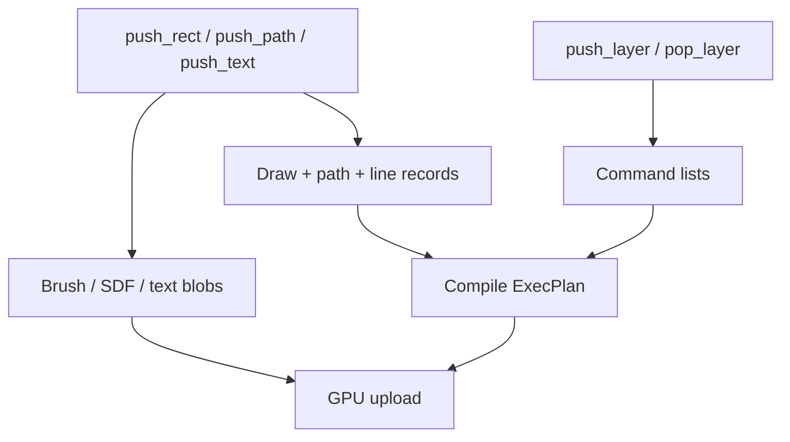

# Immediate Canvas

`Canvas` 是连续的记录容器。每个 `push_*` 写入固定 records、variable blobs 和 command lists；`append`/`append_transformed` 把另一个 Canvas 合并进当前 scene。

## 优势

- 内存连续，完整场景准备和全量渲染吞吐高。
- API 直接，适合导出、测试、小场景和每帧都完全变化的动画。
- `DrawId` 可在 Canvas 生命周期内更新 brush/color，而不必重新构造几何。

## 成本模型

重建 Canvas 通常是 O(总 records + blobs)。如果应用每帧只改变一个节点，但仍重新 append 全场，CPU encode、plan、upload 都会按总场景付费。这正是 `RetainedScene` 解决的问题。

## Layer command tree

`push_clip_*`、`push_opacity_layer`、`push_blend_layer`、`push_filter_layer`、`push_backdrop_layer` 与 `push_mask_layer` 创建嵌套 command lists。每个成功 push 都必须有一个对应 `pop_layer()`；未关闭 Canvas 不能被 append 或插入 retained scene。
