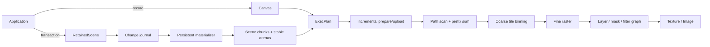
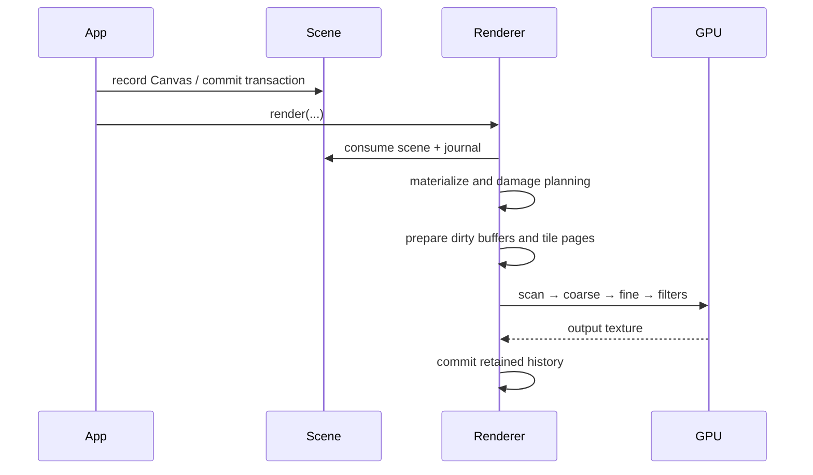

# 架构总览

Tileink 把“场景怎么变化”与“像素怎么生成”分开。`Canvas`/`RetainedScene` 负责场景语义；共享的 WGPU backend 负责 scan、binning、raster 和 filters。

## 核心模块

| 模块 | 责任 |
|---|---|
| `canvas.rs` | immediate command recording、draw records、layer command tree |
| `retained_scene.rs` | 事务、层级/order、journal、SceneChunk、稳定 arenas、增量 plan/frame |
| `shared/*` | CPU/GPU 共用数据布局、SDF、brush、filter、tile/bin 规划 |
| `wgpu/renderer/*` | materialize、damage、prepare、执行计划和输出历史 |
| `wgpu/shaders/*` | scan、coarse、fine、filter 的 WGSL 实现 |
| `text/*` | cosmic-text layout、glyph raster/atlas、GPU text records |
| `svg.rs` | usvg tree 到 Canvas 的语义转换 |

## 一帧的生命周期

## 重要不变量

- Tile 固定为 16×16 physical pixels（`TILE_SIZE`）。
- immediate 与 retained 最终共享同一套 draw/plan/shader 语义。
- painter order 由 plan 和稳定 batch metadata 明确定义，不能依赖 arena 物理地址。
- ForceFull 只改变 raster damage 策略，不能改变场景语义。
- 新 texture、尺寸/格式变化不能假设已有历史像素。
- 所有 retained transaction 要么完整提交，要么完全不改变 scene。
