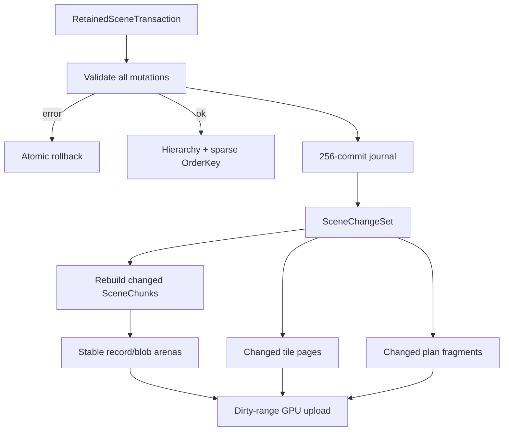

# Retained Scene

`RetainedScene` 是持久、事务式的 scene graph。每个 renderer 独立消费同一 scene 的 change journal，所以多个窗口/设备可以拥有不同 cursor。

## 节点模型

- Scene node：一个不可变 `Arc<Canvas>` 加 `kurbo::Affine` placement。
- Group node：只提供层级与 sibling order。
- Layer node：clip/isolate/opacity/blend/filter/backdrop/mask 语义。
- `RetainedParent` 同时指定 parent node 和 `Content`/`Mask` branch。

Sibling order 使用稀疏 `OrderKey` 和 `BTreeMap`；普通插入/移动为 O(log siblings)，键空间耗尽只 rebalance 当前 parent。

## Transaction 与 journal

`commit()` 先验证重复 ID、缺失 parent、cycle、非法 mask branch、scale mismatch、未关闭 Canvas、非有限/不可逆 transform 和非法尺寸，然后原子应用。成功 commit 推进 `SceneVersion`；内容 generation 由 scene 自动维护。

Journal 保留最近 256 次 commit。renderer 落后超过窗口时做一次 full sync，下一帧恢复增量消费。

## SceneChunk 与稳定 arenas

每个非-group 节点编码成独立 chunk，内部 indices 是 local 的。全局 `SceneArena<T>`/blob arenas 提供稳定 allocation handle：

- transform/content/layer descriptor 变化只重建相关 chunk；
- 删除释放 allocation，不移动其他 chunk；
- 只有 arena allocation 失败且碎片达到阈值时 compaction；
- GPU 仍使用少量全局 storage buffers，不为每个 chunk 创建 bind group。

## 增量 tile 与 plan

Tile draw index 使用 page arena：`Tile → ordered page chain → draw slots`。普通变化只改受影响 tile pages。ExecPlan 缓存 leaf/group/layer fragments；结构变化只沿变化节点到 root 更新。相邻且 layer stack 相同的 fragments 会合并 batch。

## Resize fast path

Resize 必须 full redraw，但不等于需要重建场景数据。连续 resize 会：

1. 保留 chunk geometry 和稳定 arenas；
2. 延迟 frame/spatial metadata 重建；
3. 生成一次性的 dense tile bins；
4. resize 结束后的第一次普通增量 mutation 才恢复 persistent reverse index。

这避免每个 resize frame 构造下一帧立刻失效的 per-tile mutation index。
