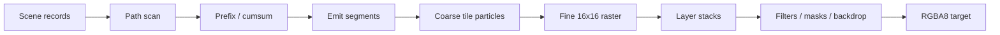

# GPU pipeline

Paths flatten to line records; scan computes tile/row crossings and allocates segment output. Analytic SDFs avoid CPU tessellation and carry affine data to GPU evaluation. Coarse work visits per-tile draw references rather than the entire draw table. Fine workgroups composite coverage, brushes, text, clips, opacity, and blend state. Non-fusible filters and masks become offscreen ExecPlan operations with stable retained surface identities.

Native and portable WGPU paths share scene formats and most shader semantics; the repository compares their output pixel-for-pixel in examples and SVG tests.
