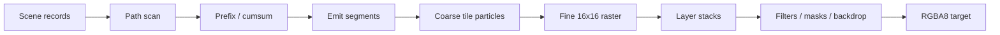

# GPU pipeline

Windows acceptance builds wgpu, DX12 and Vulkan separately. Each GPU process pins
one physical adapter and one route. Full SVG, example and retained sequences run
three times and compare raw premultiplied RGBA8 without row padding, including
RGB at zero alpha. Source, resource, font and executable hashes accompany results;
missing output or API validation errors fail acceptance. Metal device results are
recorded separately and cannot be inferred from Windows results.

Native full tile-bin uploads consume dirty journals after staging, preventing
retained geometry updates from accumulating unused entries. Abandoning a batch
does not lose the next frame's data: the next recording copies a complete snapshot.

Paths flatten to line records; scan computes tile/row crossings and allocates segment output. Analytic SDFs avoid CPU tessellation and carry affine data to GPU evaluation. Coarse work visits per-tile draw references rather than the entire draw table. Fine workgroups composite coverage, brushes, text, clips, opacity, and blend state. Non-fusible filters and masks become offscreen ExecPlan operations with stable retained surface identities.

Native and portable WGPU paths share scene formats and most shader semantics; the repository compares their output pixel-for-pixel in examples and SVG tests.

For plans containing only fused root layers, portable fine uses one frame-wide ping-pong sequence: a full redraw copies into the intermediate textures once and copies the final result out once. A partial redraw also seeds the second intermediate texture so inactive pixels survive alternation. Recursive offscreen/filter plans keep the conservative per-target path. `IncrementalRenderStats::portable_texture_copies` reports the copies that were actually encoded.

## Atomic access boundaries

Atomics are required only for concurrent winding/segment accumulation in scan count and cursor
allocation in scan emit. Clear, scan prefix, cursor initialization, cumsum, coarse, and filters
use ordinary integer access; read-only consumers also use read-only storage bindings. Ordered
dispatches establish stage dependencies, and disjoint records/chunks in both full and active
scan plans give each clear/prefix destination one writer. This removes unnecessary operations
inherited from a shared buffer's atomic declaration at their source; it is not a workaround or
a guarantee of higher FPS.

## Coarse allocation prefixes

Particle and glyph tile counts share one integer prefix chain: `coarse_prefix_chunks` computes
both local ranges, `coarse_chunk_offsets` scans chunk totals in parallel, and
`coarse_apply_chunk_offsets` adds the global offsets to both ranges. This removes the duplicated
allocation dispatches at their source, reducing six dispatches per batch to three. Chunk totals
are scanned in blocks of 256 with a carry between blocks; tail lanes participate in barriers
without writing past the valid records.

Dense coarse passes allocate in tile order. Compact incremental coarse passes use active-list order and leave
inactive tile records untouched. Normal, chunked-emit, and profiling paths retain the same
count → prefix → emit dependencies, painter order, and particle/glyph formats. Dense/compact
cost estimates account for the shared chain's workgroup count.

## Direct fine dispatch

Fine always dispatches one workgroup per tile through a single compute entry point. Removing
argument clearing, list compaction, and three indirect dispatches eliminates repeated scheduling
work in multi-batch frames. There is no scene-selection threshold or `TILEINK_FINE_DIRECT` switch.
Coarse still supplies tile kinds for the color, analytic, and full-interpreter branches inside fine.
The three classified tile lists and indirect argument buffer are gone; the active-tile list follows
the kind array directly, saving three u32 words (12 bytes) of temporary storage per tile.

Work exceeding one device dispatch dimension uses two dimensions. FineConfig carries the actual
X dispatch width so the shader reconstructs a linear index before looking up active tiles and
rejects padded workgroups in the final row. Full redraws, retained damage, resizing, and offscreen
targets share this path and must preserve exact RGBA pixels, painter order, and inactive history.

`cargo bench --bench root_batches` covers dense/sparse batches and scaled/layered Tiger scenes.
Compare separate release binaries from before and after the change, excluding compilation and
warmup. Complex large vector scenes can regress despite fewer dispatches; application resize FPS
must be measured separately from these completed-frame microbenchmarks.

Linear filters also split work at the device limit: a 4096-square clear already exceeds
65,535 groups. FilterConfig reuses a padding word for the X dispatch width. Linear kernels
reconstruct invocation indices; compact shared blur reconstructs workgroup indices and rejects
padded groups before reading active tiles. This fixes the oversized dispatch at its source;
dense shared blur retains its existing two-dimensional tile grid.

## Build-time DXIL on DX12

Windows builds precompile the single portable-fine compute entry point to Shader Model 6.0
DXIL and embed the blobs in the library. Cargo invalidates those artifacts when the WGSL, shader
patch, binding manifest, build logic, DXC discovery environment, Windows SDK bin directory, DXC
executable, or its adjacent `dxcompiler.dll`/`dxil.dll` changes. At runtime Tileink uses a blob only
when the actual D3D12 device supports Shader Model 6.0 and `PASSTHROUGH_SHADERS`, the DX12 backend,
portable textures, the 64-entry image texture table, and the entry point all match; every other
device, backend, or layout falls back to the existing WGSL path.

DXIL is independent of GPU vendor and model, while the PSO or machine code generated from it is
still adapter- and driver-specific. `Renderer::precompiled_dxil_pipeline_count` makes the selected
pipeline source observable so output-equivalent WGSL cannot be mistaken for a cache hit.
`TILEINK_DXC_PATH` selects the build-time compiler and `TILEINK_DXIL_PRECOMPILE=0` intentionally
builds the fallback path.

## Early submission for substantial native full frames

Substantial full redraws submit the first quarter of root draw batches before the CPU finishes
encoding and completing the remaining command buffers. This addresses the scheduling delay that
otherwise keeps GPU coarse/fine work behind CPU completion of the entire frame; shaders and painter
order are unchanged.

The conservative eligibility conditions are the native texture path, a full redraw, at least
1024×1024 target pixels, and at least 16 live root batches. The initial budget is the live root count
divided by four, rounded down: 33 batches give a budget of eight. This is a workload heuristic to
evaluate with benchmarks, not a fixed eighth-batch rule or a universal optimum. Small frames, partial
updates, and portable ping-pong retain their existing submission schedule.

Root batches include backdrop foreground that retains the main target; scratch-target children
and empty-bound backdrops are excluded. The prefix is submitted only when another live root batch starts. Empty batches do not consume the
budget. A frame adds at most one latency submission, and an earlier uniform-arena rollover cancels
it. Uniform writes, draws, offscreen/filter/backdrop dependencies, and the final history copy remain
ordered on the same queue. `IncrementalRenderStats::queue_submissions` reports actual submissions.

`cargo bench --bench root_batches` measures CPU-plus-GPU completion time across native/portable
paths, target sizes, and batch counts. Application FPS, p95, and longest-frame latency require a
separate end-to-end benchmark; they cannot be inferred from this microbenchmark alone.

## Shared execution boundary

`src/render/` owns frame/layer/filter order, incremental state and resource-lifetime
contracts. The WGPU adapter owns actual GPU resources and commands. Shared execution
prepares child scenes before root scan/clear, selects active batches and copies valid
history only after successful execution. Empty damage can still copy history without
preparing pipelines. Native DX12/Vulkan adapters remain unimplemented and report
explicit constructor errors.

### Filter sampling and texture capacity

Filter bilinear sampling selects four texels in logical pixel coordinates and uses explicit horizontal,
then vertical FMA for each premultiplied color and alpha channel. Both taps clamp to logical image edges,
including single rows, columns and texels. This fixes the allocation-dependent resize pixels at their source:
normalizing UV by physical capacity and recovering sampler coordinates can change weights at rounding boundaries.
Intermediate texture growth and reuse remain available, without production readbacks or waits.
The source and auxiliary inputs retain their sampled textures but no longer bind a linear sampler;
the image atlas sampler remains independent. The `filter_sampling` Criterion benchmark covers a large
liquid-glass panel at fixed size and through a four-step resize cycle; performance requires separate acceptance.

CPU scene preparation decisions are shared in `render::prepare`. Each renderer keeps
an independent outer plan key and stack-depth cache. Patched descriptor values consume
Canvas's current plan while reusing only topology size metadata; a localized scratch
plan never replaces the outer cache. Initial text preparation, retained range updates
and flat-frame reconciliation share the same entry. Each adapter owns concrete
textures, buffers, bindings and uploads.

`render::filter_program` shares the internal filter schedule: Chain/Graph input
resolution, SourceAlpha reuse, resource cursors, scratch targets and multi-pass
blur/glass lifetimes. Adapters encode individual typed `FilterKernel` operations
using concrete textures and bindings. Failed clears or pointwise operations stop
the schedule; invalid graph edges release acquired scratch. Partial blur halos,
downsampled worklists and suspended glass work are restored on failure as well as
success, without adding a GPU submission or wait.

### Collect damage propagation sources on demand

Incremental frames always calculate target tiles for removals, insertions, explicit
damage and manual invalidation. Node-attributed and unattributed source rectangles
are collected only when the command-tree propagation pass needs them. An exactly
connected delta with complete indexed backdrop damage, or a frame requiring no
dependency propagation, does not construct this auxiliary data.

This removes repeated deduplication of unused rectangle lists during bulk removals.
When propagation is needed, removed nodes still supply unattributed damage so their
old pixels invalidate later backdrops. Cross-version fallback and history recovery
are unchanged. The `retained_scale` Criterion `arena-fragmentation` case covers the
complete removal/insertion cycle.

### Lazy filter shader module reuse

The wgpu filter owner keeps eight fixed lazy module slots keyed by the complete
resource mask, including active tiles. Device, shader source, native/portable
texture mode and image-table variant belong to that owner; modules are never shared
across devices. Entry points with the same binding remap reuse a module while their
compute pipelines remain independently lazy. This fixes repeated parsing and
validation of the same full WGSL during first use of multiple filter entry points.

Renderer construction creates none of these modules or pipelines. Slot lookup,
source patching and binding remapping occur only during first kernel initialization;
steady calls reuse the existing kernel without a per-frame hash or global cache.
The `filter_compilation` Criterion benchmark checks first-filter factory work and
cached calls separately; whole-frame performance requires its own comparison.

### Numerical boundaries of glass refraction

Glass edge displacement evaluates Snell's relation using incident/refracted sines,
cosines and the tangent of their angle difference. This removes the cross-API rounding
drift from `asin -> sin -> asin -> tan`. Squared differences and angle differences use
explicit FMA. A separate grazing limit avoids denominator underflow for large finite
refractive indices. An exactly zero dispersion coefficient preserves the original sample
position, avoiding NaN from an overflowed displacement multiplied by zero.
These fix the source calculations without parameter caps, pixel snapping, production
readbacks or additional waits.

Permanent regressions invoke production WGSL for a real glass scene, 365 refraction
inputs and ordinary/extreme dispersion coordinates. Geometry also has an independent
f64 oracle; its numerical error bounds never apply to image acceptance, which still
requires byte-identical RGBA across APIs. The `filter_sampling` Criterion benchmark
covers the production glass path at fixed size and during resize. Correctness does not
establish performance acceptance or imply that native API backends are implemented.

### Invalidating backdrop scope classification

The incremental materializer caches whether any backdrop dependency is scoped.
Ordinary updates that do not involve dependency owners, dependency contents or
ancestry reuse this classification. Dependency
content changes, insertion/removal, ancestor hierarchy changes, surface changes,
journal gaps and full reconstruction refresh it. Checks cover both the old and
rebuilt dependency sets, with an empty-set fast path. This removes repeated full
dependency scans from root-backdrop updates.

Reparenting a Layer may preserve its generation and reuse its chunk. Live Scene
and Layer membership in the nonlocal and surface-dependent indexes must survive
until chunk reconstruction refreshes it. Clearing membership early can omit a
Backdrop input update on a later partial frame and produce incorrect pixels.
Permanent tests compare indexes with a fresh materializer and compare complete
RGBA from Auto and independent ForceFull rendering across post-move frames.

Root Backdrop painter order uses the same invalidation conditions. Ordinary
updates still visit dependencies and propagate damage, but reuse the ordered
painter paths instead of allocating and sorting them every frame. A scoped
dependency clears this root-only index. Reorder, reparent and journal recovery
must restore order from the current hierarchy.

Layer-only updates reuse their computed old bounds and share new bounds between
patch stability and scoped damage-source collection. Input-domain checks also
use an explicit invariant: Filter and Mask always read an isolated target, so
an already isolated old domain needs no later recheck. Unknown or fused old
domains and every other layer kind retain the complete old/new comparison.
Mixed transactions snapshot every domain that still needs comparison before
mutating commands. This rule never skips damage propagation or rendering.
