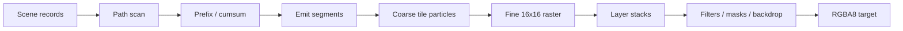

# GPU pipeline

Paths flatten to line records; scan computes tile/row crossings and allocates segment output. Analytic SDFs avoid CPU tessellation and carry affine data to GPU evaluation. Coarse work visits per-tile draw references rather than the entire draw table. Fine workgroups composite coverage, brushes, text, clips, opacity, and blend state. Non-fusible filters and masks become offscreen ExecPlan operations with stable retained surface identities.

Native and portable WGPU paths share scene formats and most shader semantics; the repository compares their output pixel-for-pixel in examples and SVG tests.

For plans containing only fused root layers, portable fine uses one frame-wide ping-pong sequence: a full redraw copies into the intermediate textures once and copies the final result out once. A partial redraw also seeds the second intermediate texture so inactive pixels survive alternation. Recursive offscreen/filter plans keep the conservative per-target path. `IncrementalRenderStats::portable_texture_copies` reports the copies that were actually encoded.

## Build-time DXIL on DX12

Windows builds precompile the four primary portable-fine compute entry points to Shader Model 6.0
DXIL and embed the blobs in the library. Cargo invalidates those artifacts when the WGSL, shader
patch, binding manifest, build logic, DXC discovery environment, Windows SDK bin directory, DXC
executable, or its adjacent `dxcompiler.dll`/`dxil.dll` changes. At runtime Tileink uses a blob only
when the actual D3D12 device supports Shader Model 6.0 and `PASSTHROUGH_SHADERS`, the DX12 backend,
portable textures, the 64-entry image texture table, and the entry point all match; every other
device, backend, or layout falls back to the existing WGSL path.

DXIL is independent of GPU vendor and model, while the PSO or machine code generated from it is
still adapter- and driver-specific. `Renderer::precompiled_dxil_pipeline_count` makes the selected
pipeline source observable so output-equivalent WGSL cannot be mistaken for a cache hit.
`TILEINK_DXC_PATH` selects the build-time compiler and `TILEINK_DXIL_PRECOMPILE=0` intentionally
builds the fallback path.
