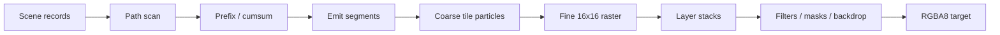

# GPU pipeline

Paths flatten to line records; scan computes tile/row crossings and allocates segment output. Analytic SDFs avoid CPU tessellation and carry affine data to GPU evaluation. Coarse work visits per-tile draw references rather than the entire draw table. Fine workgroups composite coverage, brushes, text, clips, opacity, and blend state. Non-fusible filters and masks become offscreen ExecPlan operations with stable retained surface identities.

Native and portable WGPU paths share scene formats and most shader semantics; the repository compares their output pixel-for-pixel in examples and SVG tests.

For plans containing only fused root layers, portable fine uses one frame-wide ping-pong sequence: a full redraw copies into the intermediate textures once and copies the final result out once. A partial redraw also seeds the second intermediate texture so inactive pixels survive alternation. Recursive offscreen/filter plans keep the conservative per-target path. `IncrementalRenderStats::portable_texture_copies` reports the copies that were actually encoded.

## Atomic access boundaries

Atomics are required only for concurrent winding/segment accumulation in scan count and cursor
allocation in scan emit. Clear, scan prefix, cursor initialization, cumsum, coarse, and filters
use ordinary integer access; read-only consumers also use read-only storage bindings. Ordered
dispatches establish stage dependencies, and disjoint records/chunks in both full and active
scan plans give each clear/prefix destination one writer. This removes unnecessary operations
inherited from a shared buffer's atomic declaration at their source; it is not a workaround or
a guarantee of higher FPS.

## Coarse allocation prefixes

Particle and glyph tile counts share one integer prefix chain: `coarse_prefix_chunks` computes
both local ranges, `coarse_chunk_offsets` scans chunk totals in parallel, and
`coarse_apply_chunk_offsets` adds the global offsets to both ranges. This removes the duplicated
allocation dispatches at their source, reducing six dispatches per batch to three. Chunk totals
are scanned in blocks of 256 with a carry between blocks; tail lanes participate in barriers
without writing past the valid records.

Dense coarse passes allocate in tile order. Compact incremental coarse passes use active-list order and leave
inactive tile records untouched. Normal, chunked-emit, and profiling paths retain the same
count → prefix → emit dependencies, painter order, and particle/glyph formats. Dense/compact
cost estimates account for the shared chain's workgroup count.

## Direct fine dispatch

Fine always dispatches one workgroup per tile through a single compute entry point. Removing
argument clearing, list compaction, and three indirect dispatches eliminates repeated scheduling
work in multi-batch frames. There is no scene-selection threshold or `TILEINK_FINE_DIRECT` switch.
Coarse still supplies tile kinds for the color, analytic, and full-interpreter branches inside fine.
The three classified tile lists and indirect argument buffer are gone; the active-tile list follows
the kind array directly, saving three u32 words (12 bytes) of temporary storage per tile.

Work exceeding one device dispatch dimension uses two dimensions. FineConfig carries the actual
X dispatch width so the shader reconstructs a linear index before looking up active tiles and
rejects padded workgroups in the final row. Full redraws, retained damage, resizing, and offscreen
targets share this path and must preserve exact RGBA pixels, painter order, and inactive history.

`cargo bench --bench root_batches` covers dense/sparse batches and scaled/layered Tiger scenes.
Compare separate release binaries from before and after the change, excluding compilation and
warmup. Complex large vector scenes can regress despite fewer dispatches; application resize FPS
must be measured separately from these completed-frame microbenchmarks.

Linear filters also split work at the device limit: a 4096-square clear already exceeds
65,535 groups. FilterConfig reuses a padding word for the X dispatch width. Linear kernels
reconstruct invocation indices; compact shared blur reconstructs workgroup indices and rejects
padded groups before reading active tiles. This fixes the oversized dispatch at its source;
dense shared blur retains its existing two-dimensional tile grid.

## Build-time DXIL on DX12

Windows builds precompile the single portable-fine compute entry point to Shader Model 6.0
DXIL and embed the blobs in the library. Cargo invalidates those artifacts when the WGSL, shader
patch, binding manifest, build logic, DXC discovery environment, Windows SDK bin directory, DXC
executable, or its adjacent `dxcompiler.dll`/`dxil.dll` changes. At runtime Tileink uses a blob only
when the actual D3D12 device supports Shader Model 6.0 and `PASSTHROUGH_SHADERS`, the DX12 backend,
portable textures, the 64-entry image texture table, and the entry point all match; every other
device, backend, or layout falls back to the existing WGSL path.

DXIL is independent of GPU vendor and model, while the PSO or machine code generated from it is
still adapter- and driver-specific. `Renderer::precompiled_dxil_pipeline_count` makes the selected
pipeline source observable so output-equivalent WGSL cannot be mistaken for a cache hit.
`TILEINK_DXC_PATH` selects the build-time compiler and `TILEINK_DXIL_PRECOMPILE=0` intentionally
builds the fallback path.

## Early submission for substantial native full frames

Substantial full redraws submit the first quarter of root draw batches before the CPU finishes
encoding and completing the remaining command buffers. This addresses the scheduling delay that
otherwise keeps GPU coarse/fine work behind CPU completion of the entire frame; shaders and painter
order are unchanged.

The conservative eligibility conditions are the native texture path, a full redraw, at least
1024×1024 target pixels, and at least 16 live root batches. The initial budget is the live root count
divided by four, rounded down: 33 batches give a budget of eight. This is a workload heuristic to
evaluate with benchmarks, not a fixed eighth-batch rule or a universal optimum. Small frames, partial
updates, and portable ping-pong retain their existing submission schedule.

Root batches include backdrop foreground that retains the main target; scratch-target children
and empty-bound backdrops are excluded. The prefix is submitted only when another live root batch starts. Empty batches do not consume the
budget. A frame adds at most one latency submission, and an earlier uniform-arena rollover cancels
it. Uniform writes, draws, offscreen/filter/backdrop dependencies, and the final history copy remain
ordered on the same queue. `IncrementalRenderStats::queue_submissions` reports actual submissions.

`cargo bench --bench root_batches` measures CPU-plus-GPU completion time across native/portable
paths, target sizes, and batch counts. Application FPS, p95, and longest-frame latency require a
separate end-to-end benchmark; they cannot be inferred from this microbenchmark alone.
