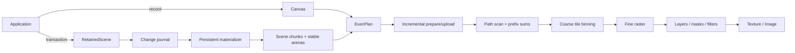

# Architecture overview

Tileink separates how scene state changes from how pixels are produced. Immediate and retained scenes converge on the same execution plan and GPU pipeline.

Core modules are `canvas.rs` for recording, `retained_scene.rs` for transactions and incremental materialization, `shared/*` for CPU/GPU layouts, `wgpu/renderer/*` for preparation and output, `wgpu/shaders/*` for compute, `text/*` for shaping/rasterization, and `svg.rs` for usvg lowering.

Important invariants: tiles are 16×16 physical pixels; painter order never depends on arena addresses; ForceFull changes raster damage rather than scene semantics; and a new or resized texture never inherits trusted history.
