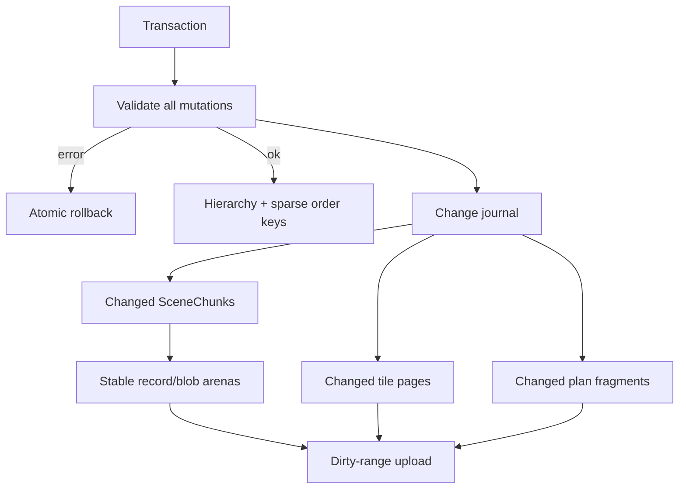

# Retained Scene

`RetainedScene` is a persistent transactional graph. Each renderer consumes its 256-commit change journal independently.

Scene leaves own an immutable `Arc<Canvas>` and a `kurbo::Affine`; groups provide hierarchy; layers provide clip, isolate, opacity, blend, filter, backdrop, or mask semantics. Transactions validate IDs, parents, cycles, mask branches, scale, closed canvases, transforms, and sizes before committing atomically.

Each non-group node becomes a local-indexed `SceneChunk`. Stable arenas prevent unrelated variable-length updates from moving live data. Tile draw pages and plan fragments update only affected regions/ancestors. During continuous resize, Tileink preserves chunks, defers exact spatial metadata, uses dense one-frame tile bins, and restores the persistent reverse index on the first later incremental mutation.
